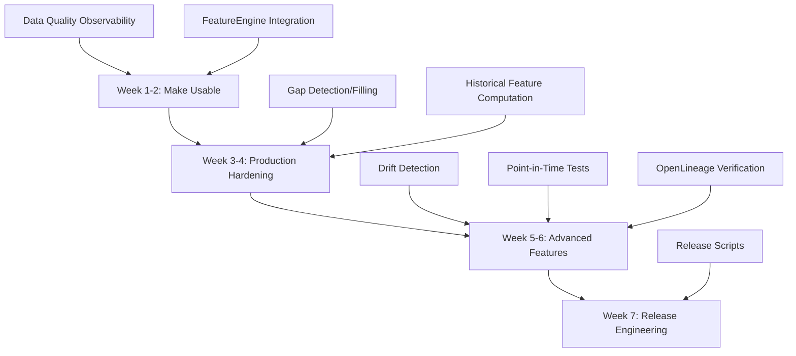

# Data Collection Pipeline Gap Analysis and Implementation Plan

## Executive Summary

After reviewing the codebase against the 4-phase implementation plans, the pipeline is **~70% complete** with solid foundations in place. This plan identifies critical gaps and provides a prioritized implementation roadmap to make the pipeline production-ready and usable.

## Current State Assessment

### ✅ **Phase 1: Foundation (85% Complete)**

- ✅ Schema Registry: Fully implemented with compatibility checking
- ✅ Great Expectations: Context and expectations implemented, **Data Docs server missing**
- ✅ Airflow: Fully configured with DAGs
- ✅ Celery: Fully configured with tasks
- ⚠️ Observability: Basic metrics exist, **Grafana dashboard incomplete**, **missing data quality metrics**

### ✅ **Phase 2: Historical Backfill (90% Complete)**

- ✅ MT5 Backfill: Fully implemented
- ✅ OHLCV Aggregation: Fully implemented
- ✅ Progress Tracking: Fully implemented
- ⚠️ Gap Detection: **Not implemented**
- ⚠️ Gap Filling: **Not implemented**

### ✅ **Phase 3: Alternative Data (80% Complete)**

- ✅ All Connectors: FRED, World Bank, ECB, RSS, Web Scraping, NewsAPI implemented
- ✅ Sentiment Analysis: FinBERT-based analyzer implemented
- ✅ Entity Extraction: Implemented
- ⚠️ Feature Integration: **Alternative data not integrated into FeatureEngine**
- ⚠️ Historical Backfill: Scripts exist but may need enhancement

### ⚠️ **Phase 4: Observability & Advanced Features (40% Complete)**

- ⚠️ OpenLineage: **Partially implemented, needs verification**
- ❌ Drift Detection: **Not implemented**
- ⚠️ Point-in-Time Validation: **Tests missing**
- ❌ Release Engineering: **Scripts missing**

## Critical Gaps to Address

### Priority 1: Make Pipeline Usable (Week 1-2)

#### 1.1 Complete Data Quality Observability

**Files to create/enhance:**

- `src/trading_server/src/infrastructure/data_quality/data_docs_server.py` (NEW)
- `src/api/src/routers/data_docs.py` (NEW)
- `src/monitoring/grafana/dashboards/data_quality.json` (ENHANCE)
- `src/trading_server/src/monitoring/metrics.py` (ENHANCE)

**Tasks:**

1. Create FastAPI endpoint to serve Great Expectations Data Docs
2. Add missing Prometheus metrics: `data_freshness_seconds`, `data_volume_total`, `data_quality_score`, `data_quarantine_rate`
3. Enhance Grafana dashboard with all data quality panels
4. Integrate metrics updates in quality gates and data collection tasks

**Acceptance Criteria:**

- Data Docs accessible via `/api/v1/data-docs/{data_type}`
- All metrics exposed and scraped by Prometheus
- Grafana dashboard shows freshness, volume, quality score, quarantine rate

#### 1.2 Integrate Alternative Data into FeatureEngine

**Files to enhance:**

- `src/trading_server/src/application/environment/feature_engine.py` (ENHANCE)

**Tasks:**

1. Add `extract_news_features(symbol, current_time)` method
2. Add `extract_macro_features(symbol, current_time)` method
3. Ensure point-in-time computation (no lookahead bias)
4. Update feature catalog with new features

**Acceptance Criteria:**

- News sentiment features available in state vector
- Macro indicator features available in state vector
- Point-in-time validation passes

### Priority 2: Production Hardening (Week 3-4)

#### 2.1 Gap Detection and Filling

**Files to create:**

- `src/trading_server/src/infrastructure/backfill/gap_detector.py` (NEW)
- `src/trading_server/src/infrastructure/backfill/gap_filler.py` (NEW)
- `src/database/scripts/31_data_gaps_table.sql` (NEW)
- `scripts/analyze_data_gaps.py` (NEW)

**Tasks:**

1. Implement gap detection for ticks, bars, news, economic indicators
2. Implement gap filling strategies (re-query, interpolation, forward-fill)
3. Create database table for gap tracking
4. Create analysis script for gap reporting

**Acceptance Criteria:**

- Can detect gaps in all data types
- Can automatically fill gaps where possible
- Gap analysis report generated

#### 2.2 Historical Feature Computation

**Files to create:**

- `src/trading_server/src/infrastructure/backfill/historical_feature_computer.py` (NEW)
- `scripts/compute_historical_features.py` (NEW)

**Tasks:**

1. Create pipeline to compute features for historical data
2. Ensure point-in-time computation
3. Support incremental computation (resume capability)
4. Store computed features

**Acceptance Criteria:**

- Can compute features for any historical time range
- Point-in-time validation passes
- Resume capability works

### Priority 3: Advanced Features (Week 5-6)

#### 3.1 Drift Detection

**Files to create:**

- `src/trading_server/src/infrastructure/data_quality/drift_detector.py` (NEW)
- `src/trading_server/src/infrastructure/data_quality/distribution_collector.py` (ENHANCE if exists)
- `src/database/scripts/30_drift_detections.sql` (VERIFY exists)

**Tasks:**

1. Implement KS test and PSI for drift detection
2. Integrate with quality gates
3. Add drift metrics to Grafana dashboard
4. Create alerting rules

**Acceptance Criteria:**

- Drift detection runs automatically
- Alerts generated on significant drift
- Metrics visible in dashboard

#### 3.2 Point-in-Time Validation Tests

**Files to create:**

- `tests/integration/test_point_in_time.py` (NEW)
- `scripts/validate_point_in_time.py` (NEW)

**Tasks:**

1. Create test suite to verify no lookahead bias
2. Create validation script for historical data
3. Integrate into CI/CD (if available)

**Acceptance Criteria:**

- Tests catch lookahead bias
- Validation script generates reports
- All existing features pass tests

#### 3.3 OpenLineage Integration Verification

**Files to verify/enhance:**

- `src/trading_server/src/infrastructure/lineage/` (VERIFY)
- All connectors (VERIFY lineage emission)

**Tasks:**

1. Verify OpenLineage is properly instrumented in all connectors
2. Create API endpoints for lineage queries
3. Test lineage tracking end-to-end

**Acceptance Criteria:**

- All connectors emit lineage events
- Lineage API endpoints work
- Can trace data from source to training

### Priority 4: Release Engineering (Week 7)

#### 4.1 Release Scripts and Documentation

**Files to create:**

- `scripts/release.sh` (NEW)
- `docs/RELEASE_CHECKLIST.md` (NEW)
- `scripts/run_quality_gates.sh` (NEW)

**Tasks:**

1. Create manual release scripts
2. Document release process
3. Create quality gate runner script

**Acceptance Criteria:**

- Release scripts run all quality gates
- Release checklist is complete
- Documentation is clear

## Implementation Sequence

## Detailed Implementation Tasks

### Task 1: Data Docs Web Server

**File**: `src/api/src/routers/data_docs.py`

- Endpoint: `GET /api/v1/data-docs/{data_type}`
- Serve static HTML from GE Data Docs store
- Auto-refresh on new validations

### Task 2: Complete Prometheus Metrics

**File**: `src/trading_server/src/monitoring/metrics.py`

- Add `data_freshness_seconds` gauge
- Add `data_volume_total` counter
- Add `data_quality_score` gauge
- Add `data_quarantine_rate` gauge
- Update metrics in quality gates and tasks

### Task 3: Enhance Grafana Dashboard

**File**: `src/monitoring/grafana/dashboards/data_quality.json`

- Add freshness panel
- Add volume panel
- Add quality score panel
- Add quarantine rate panel
- Add drift detection panel (after Task 3.1)

### Task 4: FeatureEngine Alternative Data Integration

**File**: `src/trading_server/src/application/environment/feature_engine.py`

- Add `extract_news_features()` method
- Add `extract_macro_features()` method
- Update `extract_features()` to include alternative data
- Ensure point-in-time constraints

### Task 5: Gap Detection Module

**File**: `src/trading_server/src/infrastructure/backfill/gap_detector.py`

- Implement `detect_tick_gaps()`
- Implement `detect_bar_gaps()`
- Implement `detect_news_gaps()`
- Implement `detect_economic_gaps()`

### Task 6: Gap Filling Module

**File**: `src/trading_server/src/infrastructure/backfill/gap_filler.py`

- Implement `fill_gaps()` with multiple strategies
- Integrate with connectors for re-query
- Support interpolation and forward-fill

### Task 7: Historical Feature Computer

**File**: `src/trading_server/src/infrastructure/backfill/historical_feature_computer.py`

- Implement `compute_features_for_period()`
- Implement `compute_all_features_for_symbol()`
- Support incremental computation
- Point-in-time validation

### Task 8: Drift Detector

**File**: `src/trading_server/src/infrastructure/data_quality/drift_detector.py`

- Implement KS test
- Implement PSI calculation
- Integrate with quality gates
- Add alerting

### Task 9: Point-in-Time Validation

**File**: `tests/integration/test_point_in_time.py`

- Create test dataset with known timestamps
- Verify no future data leaks
- Test all feature extraction methods

### Task 10: Release Scripts

**File**: `scripts/release.sh`

- Run all quality gates
- Run all tests
- Generate release notes
- Tag release

## Success Criteria

After implementation, the pipeline should:

1. ✅ Have complete observability (Data Docs, Grafana, Prometheus)
2. ✅ Integrate alternative data into features
3. ✅ Detect and fill data gaps automatically
4. ✅ Compute features for historical data
5. ✅ Detect distribution drift
6. ✅ Validate point-in-time constraints
7. ✅ Have release process documented and scripted

## Risk Mitigation

1. **Great Expectations Data Docs**: Use simple file serving initially, enhance later
2. **Feature Integration**: Start with basic features, expand incrementally
3. **Gap Detection**: Start with simple time-based gaps, add statistical gaps later
4. **Drift Detection**: Use simple thresholds initially, tune based on production data

## Dependencies

- Phase 1 infrastructure must be operational
- All connectors must be working
- Database tables must exist
- Airflow must be running

## Next Steps

1. **Immediate**: Start with Priority 1 tasks (make pipeline usable)
2. **Week 3**: Begin Priority 2 (production hardening)
3. **Week 5**: Begin Priority 3 (advanced features)
4. **Week 7**: Complete Priority 4 (release engineering)

This plan focuses on making the pipeline **production-ready and usable** rather than implementing every feature from the original plans. The goal is to have a working system that can collect, validate, and use data effectively.