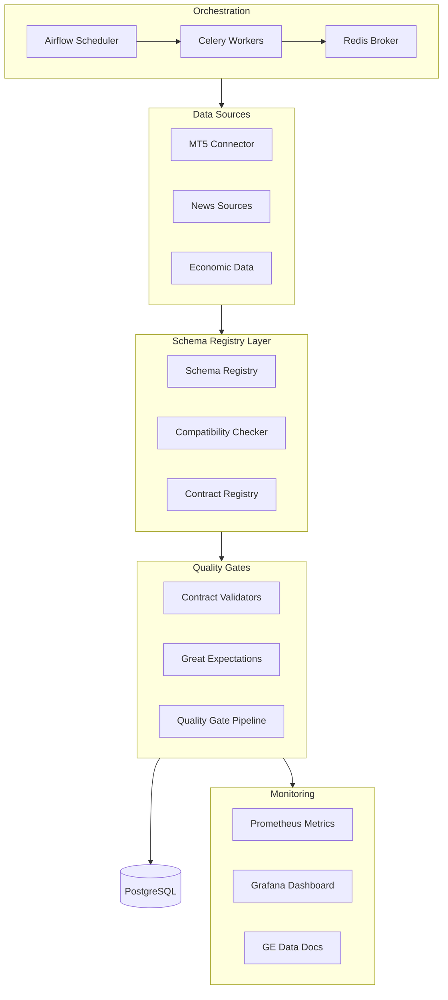

# Phase 1: Foundation Implementation Plan

## Overview

Phase 1 establishes the production-grade infrastructure foundation for the data collection pipeline. This includes:

- **Schema Registry**: Versioned schema management with compatibility checks (Confluent pattern)
- **Great Expectations**: Data quality validation with human-readable Data Docs
- **Airflow & Celery**: Orchestration for scheduled data collection
- **Observability**: Basic monitoring dashboard with Prometheus metrics

## Architecture



## Week 1: Schema Registry Implementation

### Task 1.1: Create Schema Registry Database Table

**File**: `src/database/scripts/23_schema_registry.sql`

Create the `schema_registry` table to store schema definitions with versioning support:

- Columns: `id`, `data_type`, `version`, `schema_json` (JSONB), `compatibility_mode`, `status`, `created_at`, `updated_at`
- Indexes: `(data_type, version)` unique constraint, `(data_type, status)` for queries
- Support semantic versioning (MAJOR.MINOR.PATCH format)
- Use existing `update_updated_at_column()` trigger function (from migration 00_triggers.sql)

**Reference**: Follow pattern from `15_schema_contracts.sql` but focus on schema evolution tracking rather than contract definitions.

**Acceptance Criteria:**

- Migration script created and follows existing numbering convention
- Table supports storing JSON schema definitions
- Proper indexes for query performance
- Can store multiple versions per data type

---

### Task 1.2: Implement SchemaRegistry Core Class

**File**: `src/trading_server/src/infrastructure/schema_registry/registry.py` (new)

Implement `SchemaRegistry` class with database-backed persistence:

**Key Methods:**

- `register_schema(data_type, version, schema, compatibility_mode)` - Register with compatibility check against previous version
- `get_schema(data_type, version=None)` - Retrieve schema (latest if version not specified)
- `validate_compatibility(old_schema, new_schema, mode)` - Delegate to compatibility checker
- `list_versions(data_type)` - List all versions for a data type
- `get_latest_version(data_type)` - Get latest active version

**Database Integration:**

- Use existing `Database` class from `src/trading_server/src/database.py`
- Store schemas as JSONB in `schema_registry` table
- Handle connection pooling and retries (leverage existing Database class)

**Compatibility Modes:**

- `BACKWARD`: New schema can read old data (can add optional fields, cannot remove required fields)
- `FORWARD`: Old schema can read new data (can remove optional fields, cannot add required fields)
- `FULL`: Both directions compatible
- `NONE`: No compatibility checks

**Reference**: Follow patterns from `ContractRegistry` in `src/trading_server/src/data/contracts/registry.py` for registry structure.

**Acceptance Criteria:**

- Can register schemas with semantic versioning
- Compatibility checks prevent breaking changes
- Can retrieve schemas by version or latest
- Unit tests for all methods
- Integration tests with database

---

### Task 1.3: Implement Compatibility Checker

**File**: `src/trading_server/src/infrastructure/schema_registry/compatibility.py` (new)

Implement compatibility checking logic for JSON schemas:

**Compatibility Rules:**

- **BACKWARD**: 
                                                                                                                                                                                                                                                                                                                                                                                                                                                                                                                                - ✅ Can add optional fields
                                                                                                                                                                                                                                                                                                                                                                                                                                                                                                                                - ✅ Can add enum values
                                                                                                                                                                                                                                                                                                                                                                                                                                                                                                                                - ❌ Cannot remove required fields
                                                                                                                                                                                                                                                                                                                                                                                                                                                                                                                                - ❌ Cannot change field types
                                                                                                                                                                                                                                                                                                                                                                                                                                                                                                                                - ❌ Cannot remove enum values
- **FORWARD**:
                                                                                                                                                                                                                                                                                                                                                                                                                                                                                                                                - ✅ Can remove optional fields
                                                                                                                                                                                                                                                                                                                                                                                                                                                                                                                                - ✅ Can remove enum values
                                                                                                                                                                                                                                                                                                                                                                                                                                                                                                                                - ❌ Cannot add required fields
                                                                                                                                                                                                                                                                                                                                                                                                                                                                                                                                - ❌ Cannot change field types
- **FULL**: Both BACKWARD and FORWARD checks must pass
- **NONE**: Always passes (no checks)

**Implementation:**

- Parse JSON schemas (assume JSON Schema Draft 7 format)
- Compare field definitions between old and new schemas
- Detect type changes, required/optional changes, enum changes
- Return detailed error messages for incompatible changes

**Reference**: Use `jsonschema` library for schema validation if needed, but focus on structural comparison.

**Acceptance Criteria:**

- BACKWARD compatibility detects breaking changes correctly
- FORWARD compatibility detects breaking changes correctly
- FULL compatibility enforces both checks
- Clear error messages for incompatible changes
- Unit tests for all compatibility scenarios

---

### Task 1.4: Integrate Schema Registry with Contract Validators

**File**: `src/trading_server/src/data/contracts/registry.py` (enhance existing)

Enhance `ContractRegistry` to integrate with Schema Registry:

**Changes:**

1. Add `SchemaRegistry` dependency to `ContractRegistry.__init__()`
2. On startup, register all contract validators with Schema Registry:

                                                                                                                                                                                                                                                                                                                                                                                                                                                                                                                                                                                                                                                                                                                                                                                                - Extract schema from each validator (convert contract definition to JSON schema)
                                                                                                                                                                                                                                                                                                                                                                                                                                                                                                                                                                                                                                                                                                                                                                                                - Register with appropriate version and compatibility mode

3. Before contract validation, check schema version:

                                                                                                                                                                                                                                                                                                                                                                                                                                                                                                                                                                                                                                                                                                                                                                                                - Retrieve registered schema for data type
                                                                                                                                                                                                                                                                                                                                                                                                                                                                                                                                                                                                                                                                                                                                                                                                - Validate data structure matches schema

4. Store schema version in data records:

                                                                                                                                                                                                                                                                                                                                                                                                                                                                                                                                                                                                                                                                                                                                                                                                - Add `schema_version` and `schema_type` to data before insertion
                                                                                                                                                                                                                                                                                                                                                                                                                                                                                                                                                                                                                                                                                                                                                                                                - Use existing columns if already present (from migration 15_schema_contracts.sql)

**Schema Extraction:**

- Convert contract validators' field definitions to JSON Schema format
- Map contract field types to JSON Schema types
- Preserve required/optional field information

**Reference**:

- Existing contract validators: `TickContractValidator`, `BarContractValidator`, `NewsContractValidator`, `EconomicContractValidator`
- Contract structure from `15_schema_contracts.sql` shows contract_definition JSONB format

**Acceptance Criteria:**

- Contracts auto-register with Schema Registry on startup
- Schema version checked before contract validation
- Data records include schema version metadata
- Backward compatible with existing code (no breaking changes)

---

### Task 1.5: Add Schema Registry API Endpoints

**File**: `src/api/src/routers/schema.py` (new)

Create FastAPI router for schema management following existing router patterns:

**Endpoints:**

- `GET /api/v1/schema/{data_type}` - Get latest schema for data type
- `GET /api/v1/schema/{data_type}/{version}` - Get specific version
- `POST /api/v1/schema/{data_type}` - Register new schema version (body: version, schema, compatibility_mode)
- `GET /api/v1/schema/{data_type}/versions` - List all versions for data type
- `POST /api/v1/schema/{data_type}/validate-compatibility` - Check compatibility between two schemas

**Implementation:**

- Follow pattern from `src/api/src/routers/models.py` or `src/api/src/routers/data.py`
- Use dependency injection for database session (from `services.database`)
- Create Pydantic models for request/response schemas
- Add proper error handling and validation
- Include OpenAPI documentation

**Reference**:

- Router registration in `src/api/src/main.py` (lines 144-153)
- Database dependency pattern from existing routers

**Acceptance Criteria:**

- All endpoints implemented and tested
- OpenAPI documentation generated automatically
- Proper error handling (404 for not found, 400 for validation errors)
- Integration tests pass
- Endpoints accessible via `/docs` Swagger UI

---

## Week 2: Great Expectations Integration

### Task 2.1: Install and Configure Great Expectations

**File**: `src/trading_server/requirements.txt` (update)

Add Great Expectations dependency:

- `great-expectations==0.18.0` (or latest stable)

**File**: `src/trading_server/src/infrastructure/data_quality/ge_context.py` (new)

Create GE context configuration:

- Initialize GE Data Context
- Configure Data Docs store (local filesystem: `data_docs/` directory)
- Set up expectations store (local filesystem: `expectations/` directory)
- Configure validations store (local filesystem: `validations/` directory)

**Reference**: Follow GE quickstart pattern, but integrate with existing project structure.

**Acceptance Criteria:**

- Great Expectations installed
- Data context configured and accessible
- Data Docs store accessible
- Can create expectation suites programmatically

---

### Task 2.2: Create Expectation Suites from Contract Validators

**File**: `src/trading_server/src/infrastructure/data_quality/ge_expectations.py` (new)

Convert existing contract validators to Great Expectations expectation suites:

**Mapping Strategy:**

- Required fields → `expect_column_to_exist()`
- Type checks → `expect_column_values_to_be_of_type()`
- Range checks → `expect_column_values_to_be_between()`
- Format checks → `expect_column_values_to_match_regex()`
- Business rules → Custom expectations or `expect_column_pair_values_A_to_be_greater_than_B()`

**Expectation Suites:**

- `tick_expectations` - From `TickContractValidator`
- `bar_expectations` - From `BarContractValidator`
- `news_expectations` - From `NewsContractValidator`
- `economic_expectations` - From `EconomicContractValidator`

**Implementation:**

- Create utility function to convert contract definition to GE expectations
- Programmatically build expectation suites
- Store suites in GE expectations store

**Reference**:

- Contract validators in `src/trading_server/src/data/contracts/`
- Contract definitions in `15_schema_contracts.sql`

**Acceptance Criteria:**

- Expectation suites created for all data types
- All contract rules converted to expectations
- Suites validate same rules as contract validators
- Unit tests verify expectation correctness

---

### Task 2.3: Integrate Great Expectations into Quality Gates

**File**: `src/trading_server/src/data/quality_gates.py` (enhance existing)

Enhance `QualityGate` class to run Great Expectations validation:

**Changes:**

1. After contract validation, run GE validation:

                                                                                                                                                                                                                                                                                                                                                                                                                                                                                                                                                                                                                                                                                                                                                                                                - Load appropriate expectation suite for data type
                                                                                                                                                                                                                                                                                                                                                                                                                                                                                                                                                                                                                                                                                                                                                                                                - Create GE validator from data batch
                                                                                                                                                                                                                                                                                                                                                                                                                                                                                                                                                                                                                                                                                                                                                                                                - Run validation
                                                                                                                                                                                                                                                                                                                                                                                                                                                                                                                                                                                                                                                                                                                                                                                                - Store validation results

2. Generate Data Docs after validation:

                                                                                                                                                                                                                                                                                                                                                                                                                                                                                                                                                                                                                                                                                                                                                                                                - Save validation results to GE validations store
                                                                                                                                                                                                                                                                                                                                                                                                                                                                                                                                                                                                                                                                                                                                                                                                - Trigger Data Docs regeneration

3. Track validation metrics:

                                                                                                                                                                                                                                                                                                                                                                                                                                                                                                                                                                                                                                                                                                                                                                                                - Pass rate per expectation
                                                                                                                                                                                                                                                                                                                                                                                                                                                                                                                                                                                                                                                                                                                                                                                                - Failure reasons
                                                                                                                                                                                                                                                                                                                                                                                                                                                                                                                                                                                                                                                                                                                                                                                                - Expose metrics to Prometheus

**Integration Points:**

- Use existing quality gate pipeline structure
- Store GE validation results alongside contract validation results
- Maintain backward compatibility (GE validation is additive)

**Reference**: Existing quality gate structure and contract validation flow.

**Acceptance Criteria:**

- GE validation runs in quality gate pipeline
- Data Docs generated after validation
- Validation results stored and queryable
- Metrics tracked in Prometheus
- No breaking changes to existing quality gate behavior

---

### Task 2.4: Set Up Data Docs Web Server

**File**: `src/trading_server/src/infrastructure/data_quality/data_docs_server.py` (new)

Create simple web server to serve Great Expectations Data Docs:

**Options:**

1. **Standalone server**: Simple HTTP server serving static HTML from Data Docs store
2. **API integration**: Add endpoint to FastAPI to serve Data Docs
3. **Dashboard integration**: Link to Data Docs from Grafana dashboard

**Recommendation**: Option 2 - Add FastAPI endpoint for Data Docs access.

**Implementation:**

- Add endpoint: `GET /api/v1/data-docs/{data_type}` - Serve Data Docs HTML
- Or: `GET /api/v1/data-docs/{data_type}/index.html` - Redirect to latest validation
- Serve static files from GE Data Docs store directory

**Acceptance Criteria:**

- Data Docs accessible via web UI
- Auto-updates on new validations
- Can view historical validation results
- Accessible from dashboard or standalone

---

## Week 3: Airflow & Celery Setup

### Task 3.1: Add Redis Service to docker-compose.yml

**File**: `docker-compose.yml` (update)

Add Redis service for Celery broker:

```yaml
redis:
  image: redis:7-alpine
  container_name: redis
  ports:
 - "6379:6379"
  volumes:
 - redis_data:/data
  command: redis-server --appendonly yes
  healthcheck:
    test: ["CMD", "redis-cli", "ping"]
    interval: 10s
    timeout: 5s
    retries: 5
```

**Reference**: Check existing `docker-compose.yml` structure for consistency.

**Acceptance Criteria:**

- Redis service added to docker-compose.yml
- Service starts successfully
- Health checks pass
- Data persists across restarts (volume mounted)

---

### Task 3.2: Add Airflow Services to docker-compose.yml

**File**: `docker-compose.yml` (update)

Add Airflow services (webserver, scheduler, worker):

**Services:**

- `airflow-webserver` - Web UI (port 8080)
- `airflow-scheduler` - DAG scheduler
- `airflow-worker` - Celery worker for task execution

**Configuration:**

- Use PostgreSQL as metadata database (existing `db` service)
- Set up volume mounts for DAGs: `./src/trading_server/src/infrastructure/data_pipeline/airflow/dags:/opt/airflow/dags`
- Set up volume mounts for logs: `./airflow_logs:/opt/airflow/logs`
- Environment variables for service communication
- Use official `apache/airflow` image

**Reference**: Airflow docker-compose patterns, but integrate with existing services.

**Acceptance Criteria:**

- All Airflow services added
- Services start successfully
- Airflow UI accessible at `http://localhost:8080`
- Scheduler running
- Workers processing tasks

---

### Task 3.3: Create Airflow DAG Structure

**File**: `src/trading_server/src/infrastructure/data_pipeline/airflow/dags/` (new directory)

Create directory structure:

- `dags/` - DAG definitions (mounted in docker-compose)
- `plugins/` - Custom operators (if needed)
- `config/` - Airflow configuration files

**Initial Setup:**

- Create `__init__.py` files
- Create `.gitkeep` files if directories are empty
- Document structure in README

**Acceptance Criteria:**

- Directory structure created
- DAGs directory mounted in docker-compose
- Airflow can discover DAGs
- No import errors in Airflow UI

---

### Task 3.4: Create Initial Data Collection DAG

**File**: `src/trading_server/src/infrastructure/data_pipeline/airflow/dags/data_collection_pipeline.py` (new)

Create DAG for hourly data collection:

**DAG Configuration:**

- Schedule: `@hourly` (or `0 * * * *` cron)
- Start date: Current date
- Catchup: False (don't backfill on first run)
- Max active runs: 1

**Tasks:**

- `collect_mt5_data` - Placeholder task (will use real connector in Phase 2)
- `collect_economic_calendar` - Placeholder task
- Task dependencies: Run in parallel (no dependencies initially)

**Task Implementation:**

- Use `PythonOperator` to call Celery tasks
- Or use `BashOperator` as placeholder
- Add retry logic: 3 retries, exponential backoff
- Add error notifications (logging for now, Slack/email in future)

**Reference**: Airflow DAG patterns, Celery integration.

**Acceptance Criteria:**

- DAG created and visible in Airflow UI
- DAG runs on schedule (hourly)
- Tasks retry on failure
- Alerts logged on failure
- Integration tests verify DAG execution

---

### Task 3.5: Create Celery Task Structure

**File**: `src/trading_server/src/infrastructure/data_pipeline/celery_app.py` (new)

Create Celery application:

**Configuration:**

- Redis as broker: `redis://redis:6379/0`
- Redis as result backend: `redis://redis:6379/0`
- Task serialization: JSON
- Result expiration: 3600 seconds

**Task Modules:**

- `tasks/market_data_tasks.py` - MT5 data collection tasks
- `tasks/news_data_tasks.py` - News collection tasks (placeholder)
- `tasks/economic_data_tasks.py` - Economic data tasks

**Task Structure:**

```python
@celery_app.task(bind=True, max_retries=3)
def collect_mt5_data(self, symbol: str, start_time: datetime, end_time: datetime):
    # Task implementation
    pass
```

**Integration:**

- Tasks call existing connector methods
- Handle errors and retries
- Return task results

**Reference**: Celery best practices, existing connector interfaces.

**Acceptance Criteria:**

- Celery app configured
- Tasks can be queued and executed
- Results stored in Redis
- Integration with Airflow DAGs works
- Tasks handle errors gracefully

---

## Week 4: Basic Observability Dashboard

### Task 4.1: Create Data Quality Grafana Dashboard

**File**: `src/monitoring/grafana/dashboards/data_quality.json` (new)

Create Grafana dashboard JSON with panels:

**Panels:**

1. **Freshness**: Time since last data (per source/symbol)

                                                                                                                                                                                                                                                                                                                                                                                                                                                                                                                                                                                                                                                                                                                                                                                                - Query: `data_freshness_seconds{source="mt5", symbol="EURUSD"}`
                                                                                                                                                                                                                                                                                                                                                                                                                                                                                                                                                                                                                                                                                                                                                                                                - Visualization: Stat panel or time series

2. **Volume**: Records per hour/day (per source/symbol)

                                                                                                                                                                                                                                                                                                                                                                                                                                                                                                                                                                                                                                                                                                                                                                                                - Query: `rate(data_volume_total[1h])`
                                                                                                                                                                                                                                                                                                                                                                                                                                                                                                                                                                                                                                                                                                                                                                                                - Visualization: Time series

3. **Quality Score**: 0-1 score based on validation results

                                                                                                                                                                                                                                                                                                                                                                                                                                                                                                                                                                                                                                                                                                                                                                                                - Query: `data_quality_score{source="mt5"}`
                                                                                                                                                                                                                                                                                                                                                                                                                                                                                                                                                                                                                                                                                                                                                                                                - Visualization: Gauge or time series

4. **Quarantine Rate**: Percentage of rejected data

                                                                                                                                                                                                                                                                                                                                                                                                                                                                                                                                                                                                                                                                                                                                                                                                - Query: `data_quarantine_rate{source="mt5"}`
                                                                                                                                                                                                                                                                                                                                                                                                                                                                                                                                                                                                                                                                                                                                                                                                - Visualization: Gauge or time series

**Dashboard Configuration:**

- Auto-refresh: 30s
- Time range: Last 24 hours (default)
- Variables: `source`, `symbol` (for filtering)

**Reference**: Existing Grafana dashboard patterns if any, Prometheus query syntax.

**Acceptance Criteria:**

- Dashboard created and accessible
- All metrics displayed correctly
- Dashboard auto-refreshes
- Can filter by source, symbol, time range

---

### Task 4.2: Add Data Quality Prometheus Metrics

**File**: `src/trading_server/src/monitoring/metrics.py` (enhance existing or create new)

Add Prometheus metrics for data quality:

**Metrics:**

- `data_freshness_seconds` - Gauge (time since last data, labels: source, symbol)
- `data_volume_total` - Counter (total records, labels: source, symbol)
- `data_quality_score` - Gauge (0-1 score, labels: source, symbol)
- `data_quarantine_rate` - Gauge (percentage, labels: source, symbol)

**Integration:**

- Update metrics in quality gate pipeline
- Update metrics when data is collected
- Expose metrics via `/metrics` endpoint (if not already exposed)

**Reference**:

- Existing metrics patterns in codebase
- Prometheus Python client usage

**Acceptance Criteria:**

- All metrics defined
- Metrics exposed via `/metrics` endpoint
- Prometheus scraping metrics
- Metrics appear in Grafana dashboard

---

### Task 4.3: Create Phase 1 Integration Tests

**File**: `tests/integration/test_phase1_foundation.py` (new)

Create integration tests for Phase 1:

**Test Scenarios:**

1. **Schema Registry E2E**:

                                                                                                                                                                                                                                                                                                                                                                                                                                                                                                                                                                                                                                                                                                                                                                                                - Register schema → Retrieve schema → Check compatibility → List versions

2. **Great Expectations Validation**:

                                                                                                                                                                                                                                                                                                                                                                                                                                                                                                                                                                                                                                                                                                                                                                                                - Create expectation suite → Validate data → Check Data Docs generated

3. **Airflow DAG Execution**:

                                                                                                                                                                                                                                                                                                                                                                                                                                                                                                                                                                                                                                                                                                                                                                                                - Trigger DAG → Verify tasks execute → Check task states

4. **Data Quality Metrics**:

                                                                                                                                                                                                                                                                                                                                                                                                                                                                                                                                                                                                                                                                                                                                                                                                - Collect data → Verify metrics updated → Check Grafana dashboard

**Test Setup:**

- Use test database (separate from production)
- Mock external services (MT5, etc.)
- Clean up after tests

**Reference**: Existing test patterns in `tests/integration/`.

**Acceptance Criteria:**

- All integration tests pass
- Tests cover critical paths
- Tests run in CI/CD (if configured)
- Tests are maintainable and well-documented

---

## Implementation Dependencies

### Critical Path

```
Task 1.1 (Schema Registry Table)
  ↓
Task 1.2 (SchemaRegistry Class)
  ↓
Task 1.3 (Compatibility Checker)
  ↓
Task 1.4 (Contract Integration)
  ↓
Task 1.5 (API Endpoints)
  ↓
Task 2.1 (GE Installation)
  ↓
Task 2.2 (Expectation Suites)
  ↓
Task 2.3 (Quality Gate Integration)
  ↓
Task 3.1 (Redis)
  ↓
Task 3.2 (Airflow Services)
  ↓
Task 3.3 (DAG Structure)
  ↓
Task 3.4 (Data Collection DAG)
  ↓
Task 3.5 (Celery Tasks)
  ↓
Task 4.1 (Grafana Dashboard)
  ↓
Task 4.2 (Prometheus Metrics)
  ↓
Task 4.3 (Integration Tests)
```

### Key Dependencies

- **Schema Registry** → Required before contract integration
- **Compatibility Checker** → Required for schema registration
- **Great Expectations** → Can proceed in parallel with Schema Registry
- **Airflow Setup** → Requires Redis first
- **Observability** → Requires metrics from quality gates

---

## Success Criteria

- [ ] Schema Registry operational with compatibility checks
- [ ] Great Expectations Data Docs accessible
- [ ] Airflow DAGs running hourly (even if placeholder tasks)
- [ ] Data quality dashboard showing key metrics
- [ ] All integration tests pass
- [ ] Documentation updated

---

## Risk Mitigation

1. **Schema Registry Complexity**: Start with simple compatibility checks, iterate based on needs
2. **Great Expectations Learning Curve**: Use existing contract validators as starting point
3. **Airflow Setup Complexity**: Follow official Airflow docker-compose patterns, test incrementally
4. **Metrics Integration**: Start with basic metrics, expand based on needs

---

## Next Steps After Phase 1

Once Phase 1 is complete, proceed to Phase 2 (Historical Backfill) which will:

- Implement MT5 historical backfill
- Create OHLCV aggregation
- Add backfill orchestration via Airflow