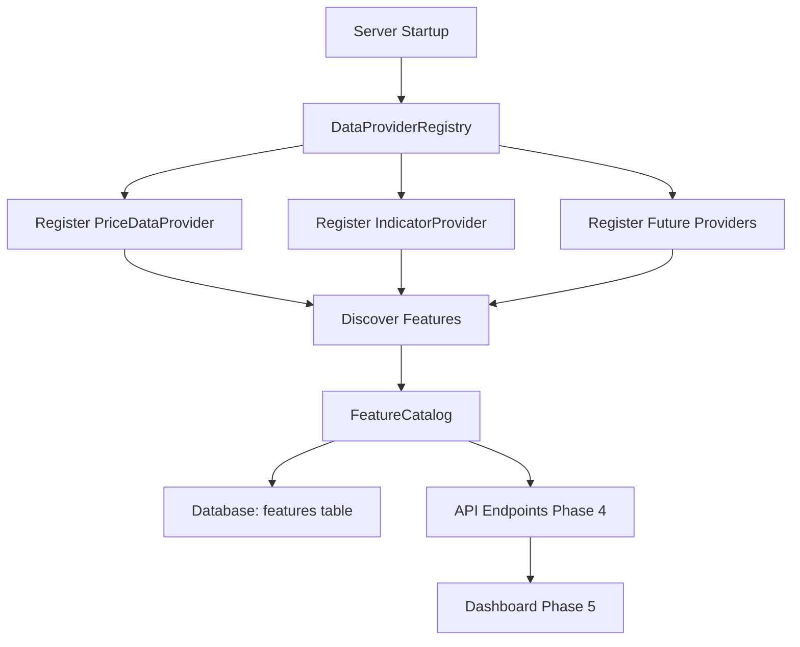

# Phase 2: Data Source Plugin System

## Overview

Phase 2 implements the foundational data source plugin system that enables developers to add new data providers through code. The system automatically discovers all registered providers, extracts their feature metadata, and stores it in a database-backed feature catalog. This enables the dashboard (Phase 5) to display all available features for experiment configuration.

## Architecture



## Implementation Tasks

### 2.1 Enhance Base Provider Interface

**File**: `src/mt5-python_server/src/data_providers/base_provider.py`

**Changes**:

- Add `Feature` dataclass with metadata fields:
  - `name: str` - Unique feature identifier
  - `data_type: type` - Python type (float, int, str, etc.)
  - `source: str` - Provider name
  - `description: str` - Human-readable description
  - `category: Optional[str]` - Feature category (price, technical, economic, etc.)
- Add abstract method `get_features() -> List[Feature] `to `DataProvider` base class
- Add optional abstract method `collect_historical(start, end) -> pd.DataFrame` for backtesting support

**Integration**: All existing and future providers must implement `get_features()`.

### 2.2 Create Data Provider Registry

**New File**: `src/mt5-python_server/src/data_providers/registry.py`

**Class**: `DataProviderRegistry`

**Methods**:

- `register_provider(name: str, provider: DataProvider) -> None` - Register a provider instance
- `discover_features() -> List[Feature]` - Extract features from all registered providers
- `get_provider(name: str) -> Optional[DataProvider]` - Retrieve provider by name
- `get_all_providers() -> Dict[str, DataProvider]` - Get all registered providers
- `check_health() -> Dict[str, bool]` - Health check for each provider (checks if data is stale)
- `unregister_provider(name: str) -> None` - Remove provider (P1 feature)

**Implementation Notes**:

- Use thread-safe dictionary for provider storage
- Handle errors gracefully when discovering features (log and continue)
- Support provider metadata (version, description)

### 2.3 Create Indicator Provider

**New File**: `src/mt5-python_server/src/data_providers/indicator_provider.py`

**Class**: `IndicatorProvider(DataProvider)`

**Purpose**: Wraps existing `TechnicalIndicators` class to expose technical indicators as data provider features.

**Features to Expose**:

- RSI (14-period): `rsi_14`
- MACD components: `macd_line`, `macd_signal`, `macd_histogram`
- Bollinger Bands: `bollinger_upper`, `bollinger_middle`, `bollinger_lower`, `bollinger_width`
- Moving Averages: `sma_20`, `sma_50`, `ema_12`, `ema_26`
- ATR (if available): `atr_14`
- Price changes: `price_change`, `price_change_pct`

**Implementation**:

- Requires price history buffer (from `PriceDataProvider` or currency pair)
- Calculate indicators on-demand from recent price history
- Subscribe to price updates to maintain indicator state
- Declare all features in `get_features()` method

**Integration**: One `IndicatorProvider` instance per currency pair, registered with pair symbol as name (e.g., "indicator_EURUSD").

### 2.4 Create Feature Catalog System

**New File**: `src/mt5-python_server/src/features/catalog.py`

**Class**: `FeatureCatalog`

**Methods**:

- `store_features(features: List[Feature]) -> None` - Store features in database
- `get_all_features() -> List[Feature]` - Retrieve all features from database
- `get_features_by_source(source: str) -> List[Feature]` - Filter by provider source
- `get_features_by_category(category: str) -> List[Feature]` - Filter by category
- `update_feature_availability(name: str, available: bool) -> None` - Update availability status
- `get_feature(name: str) -> Optional[Feature]` - Get single feature by name
- `sync_with_registry(registry: DataProviderRegistry) -> None` - Sync catalog with registry

**Database Integration**:

- Use existing database connection from `database.py`
- Handle duplicate features (update existing vs. insert new)
- Track feature statistics (min, max, mean) when available (P1)

### 2.5 Database Migration

**New File**: `database/scripts/06_features.sql`

**Table**: `features`

```sql
CREATE TABLE features (
    id INT PRIMARY KEY AUTO_INCREMENT,
    name VARCHAR(100) UNIQUE NOT NULL,
    data_type VARCHAR(20) NOT NULL,
    source VARCHAR(50) NOT NULL,
    description TEXT,
    category VARCHAR(50),
    available BOOLEAN DEFAULT TRUE,
    min_value DOUBLE,
    max_value DOUBLE,
    mean_value DOUBLE,
    created_at TIMESTAMP DEFAULT CURRENT_TIMESTAMP,
    updated_at TIMESTAMP DEFAULT CURRENT_TIMESTAMP ON UPDATE CURRENT_TIMESTAMP,
    INDEX idx_source (source),
    INDEX idx_category (category),
    INDEX idx_available (available)
);
```

**Migration Notes**:

- Run before server startup
- Add to migration sequence in `database/scripts/`

### 2.6 Update PriceDataProvider

**File**: `src/mt5-python_server/src/data_providers/price_provider.py`

**Changes**:

- Implement `get_features()` method returning:
  - `price_bid` (float)
  - `price_ask` (float)
  - `price_mid` (float)
  - `spread` (float) - calculated as ask - bid
- Add feature metadata with descriptions
- Category: "price"

### 2.7 Server Integration

**File**: `src/mt5-python_server/src/server.py`

**Changes in `Server.__init__()`**:

1. Initialize `DataProviderRegistry` instance
2. Register existing `PriceDataProvider` instances (one per currency pair)
3. Create and register `IndicatorProvider` instances (one per currency pair)
4. Initialize `FeatureCatalog` instance
5. Call `registry.discover_features()` to extract all features
6. Call `catalog.sync_with_registry(registry)` to populate database
7. Store registry and catalog as instance attributes for API access (Phase 4)

**Error Handling**:

- Log warnings if provider registration fails
- Continue startup even if some providers fail
- Provide startup summary of registered providers and discovered features

### 2.8 Provider Extension Documentation

**New File**: `docs/data-source-guide/ADDING_DATA_SOURCES.md`

**Content**:

- Overview of data provider system
- Step-by-step guide:

  1. Create new provider class inheriting from `DataProvider`
  2. Implement required methods (`get_current_data`, `subscribe`, `get_features`)
  3. Declare features with metadata
  4. Register provider in server startup

- Code examples (sentiment provider example from PRD)
- Feature declaration patterns
- Best practices (error handling, threading, data validation)
- Testing guidelines

## Dependencies

- **Phase 1**: Must be completed (safety infrastructure)
- **Database**: MariaDB connection must be available
- **Existing Code**: 
  - `TechnicalIndicators` class exists
  - `PriceDataProvider` exists but needs enhancement
  - `CurrencyPair` model for price data

## Success Criteria

- All existing providers implement `get_features()` method
- Registry discovers all registered providers on startup
- Feature catalog populated in database with all features
- Indicator provider exposes technical indicators as features
- Documentation enables developers to add new providers in < 4 hours
- Server startup logs show registered providers and feature count

## Testing Strategy

**Unit Tests** (`tests/unit/test_data_providers.py`):

- Test `DataProviderRegistry` registration and discovery
- Test `FeatureCatalog` CRUD operations
- Test `IndicatorProvider` feature calculation
- Test `PriceDataProvider` feature declaration

**Integration Tests** (`tests/integration/test_feature_discovery.py`):

- Test full startup flow: registry → discovery → catalog → database
- Test feature availability updates
- Test provider health checks

## Files to Create/Modify

**New Files**:

- `src/mt5-python_server/src/data_providers/registry.py`
- `src/mt5-python_server/src/data_providers/indicator_provider.py`
- `src/mt5-python_server/src/features/__init__.py`
- `src/mt5-python_server/src/features/catalog.py`
- `database/scripts/06_features.sql`
- `docs/data-source-guide/ADDING_DATA_SOURCES.md`

**Modified Files**:

- `src/mt5-python_server/src/data_providers/base_provider.py` - Add Feature dataclass and abstract methods
- `src/mt5-python_server/src/data_providers/price_provider.py` - Implement get_features()
- `src/mt5-python_server/src/server.py` - Integrate registry and catalog on startup

## Next Phase Dependencies

Phase 2 enables:

- **Phase 3**: Experiments can reference features by name from catalog
- **Phase 4**: API endpoints can list features from catalog
- **Phase 5**: Dashboard can display features for experiment builder UI