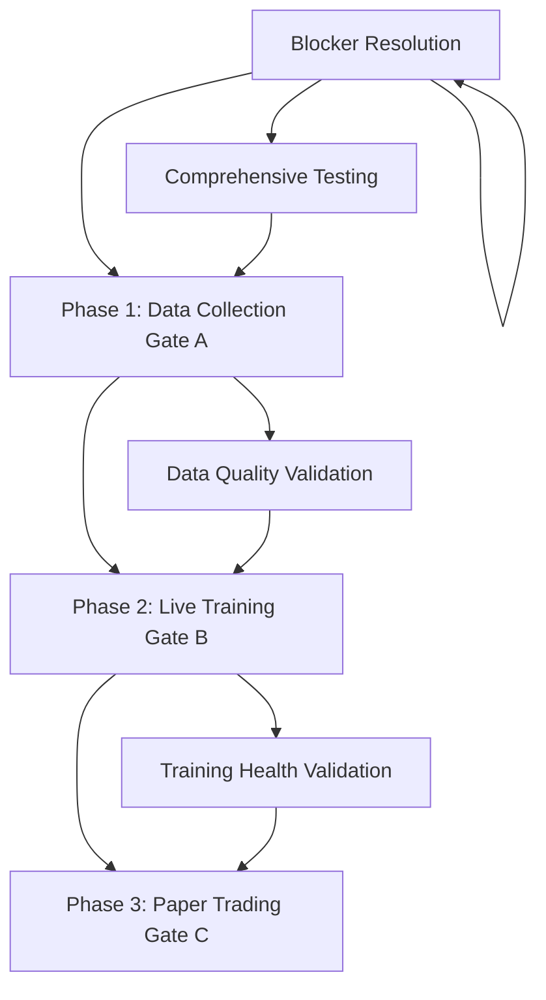

# Production Release Rollout Plan

## Overview

This plan provides a systematic, gated approach to rolling out production capabilities. Each phase has clear prerequisites, implementation steps, validation criteria, and rollback procedures.

## Release Phases



## Phase 0: Pre-Release Preparation (Week 1-2)

**Goal**: Fix all blockers and establish testing infrastructure before any production rollout.

### 0.1 Fix Gate A Blockers

**Blocker A1: Data Quarantine**

- Create migration: `src/database/scripts/14_add_quarantine_table.sql`
- Modify: `src/mt5-python_server/src/data/quality_gates.py` - Add quarantine insert on rejection
- Modify: `src/mt5-python_server/src/database.py` - Add `insert_quarantine_tick()` method
- Add API endpoint: `GET /api/v1/data/quarantine` for review
- Add alert: Quarantine rate > 10%

**Blocker A2: Schema Contracts**

- Create: `docs/SCHEMA_CONTRACTS.md` with field requirements (types, units, formats)
- Add validation: `src/mt5-python_server/src/data/quality_gates.py` - Schema contract check
- Add contract versioning: Track schema version in database

### 0.2 Fix Gate B Blockers

**Blocker B1: Reproducibility**

- Modify: `src/mt5-python_server/src/mlops/experiment_tracker.py` - Log git commit hash in MLflow tags
- Modify: `src/mt5-python_server/src/experiments/runner.py` - Save config as artifact, log data version
- Add: Random seed logging and enforcement (numpy, tensorflow, python)
- Add: Environment logging (requirements.txt hash)

**Blocker B2: RL Safety Constraints**

- Modify: `src/mt5-python_server/src/application/training/training_loop.py` - Add action validation before execution
- Modify: `src/mt5-python_server/src/risk/pre_trade_controls.py` - Add training-mode validation
- Add: Hard position size cap (10% of account)
- Add: Hard leverage cap (100:1)

**Blocker B3: Training Divergence Detection**

- Modify: `src/mt5-python_server/src/application/training/training_loop.py` - Add health checks (loss trend, NaN, gradient norm)
- Modify: `src/mt5-python_server/src/application/training/checkpoint_manager.py` - Add rollback mechanism
- Add: Automatic checkpointing before each training step
- Add: Alert on divergence detection

**Blocker B4: Look-Ahead Bias Validation**

- Modify: `.github/workflows/ci.yml` - Add `test_lookahead_bias.py` to CI pipeline
- Modify: `src/mt5-python_server/src/application/environment/feature_engine.py` - Enforce `current_time` parameter
- Add: Validation that training queries use `receive_time` constraint

### 0.3 Testing Infrastructure

**Unit Tests** (Location: `tests/unit/`)

- `test_schema_contracts.py` - Schema validation
- `test_quality_gates_quarantine.py` - Quarantine mechanism
- `test_reproducibility_metadata.py` - Reproducibility logging
- `test_training_health_checks.py` - Divergence detection
- `test_action_constraints.py` - RL safety constraints

**Integration Tests** (Location: `tests/integration/`)

- `test_data_quarantine_flow.py` - End-to-end quarantine
- `test_reproducibility_end_to_end.py` - Full reproducibility
- `test_training_rollback.py` - Rollback mechanism
- `test_lookahead_bias_validation.py` - Point-in-time constraints
- `test_action_constraints_training.py` - Constraints in training loop

**Safety Tests** (Location: `tests/integration/`)

- `test_kill_switch_under_load.py` - Load testing
- `test_kill_switch_time_budget.py` - Time budget validation
- `test_action_limits_enforcement.py` - Limit enforcement

### 0.4 Monitoring & Observability

**Dashboards** (Location: `monitoring/grafana/dashboards/`)

- `data-quality.json` - Tick ingestion, acceptance/rejection rates, gaps
- `training-health.json` - Loss trend, NaN count, gradient norm, action rejection rate
- `system-health.json` - API latency, database latency, kill switch status

**Alerts** (Location: `monitoring/prometheus/alerts/`)

- Critical: Kill switch active, data gap > 5min, training NaN, circuit breaker open
- Warning: Rejection rate > 10%, quarantine rate > 5%, data staleness > 60s

**Runbooks** (Location: `docs/runbooks/`)

- `data-feed-stale.md` - Data feed outage response
- `training-divergence.md` - Training health issues
- `storage-saturation.md` - Disk space issues
- `kill-switch-procedure.md` - Emergency stop

### Phase 0 Success Criteria

- All blockers fixed and tested
- All unit/integration tests passing (>80% coverage)
- Monitoring dashboards deployed
- Runbooks documented
- Team trained on runbooks

---

## Phase 1: Data Collection Rollout (Gate A) - Week 3

**Goal**: Enable production data collection with full monitoring and quality gates.

### 1.1 Pre-Deployment Checklist

**Prerequisites**:

- ✅ All Phase 0 blockers resolved
- ✅ All tests passing
- ✅ Monitoring dashboards live
- ✅ Runbooks reviewed by team

### 1.2 Deployment Steps

**Day 1-2: Infrastructure Deployment**

1. Deploy database migration (quarantine table)
2. Deploy updated quality gates with quarantine
3. Deploy monitoring dashboards
4. Verify alerts are configured and routing correctly

**Day 3: Single Symbol Pilot**

1. Enable data collection for EURUSD only
2. Monitor for 24 hours:

   - Tick acceptance rate (target: >90%)
   - Data gaps (target: <60s during market hours)
   - Quarantine rate (target: <5%)
   - Schema violations (target: 0)

**Day 4-5: Validation & Review**

1. Review quarantine data for systematic issues
2. Verify gap detection alerts fire correctly
3. Check data quality metrics meet targets
4. Review logs for any anomalies

**Day 6: Expand to All Symbols**

1. If metrics acceptable, enable all currency pairs
2. Continue monitoring for 24 hours
3. Review quarantine data daily

**Day 7: Production Handoff**

1. Document any operational learnings
2. Hand off to operations team
3. Set up daily review process

### 1.3 Success Criteria

- Tick acceptance rate > 90%
- Data gap duration < 60 seconds (during market hours)
- Quarantine rate < 5%
- Zero schema violations
- All alerts firing correctly
- No data loss incidents

### 1.4 Rollback Procedure

```bash
# Disable data collection
export DATA_COLLECTION_ENABLED=false
docker compose restart server

# Verify no new ticks ingested
# Review quarantine table for issues
```

### 1.5 Go/No-Go Decision Point

**Go Criteria**:

- All success criteria met for 7 days
- No critical incidents
- Team confident in operations

**No-Go**: Extend Phase 1, fix issues, retry

---

## Phase 2: Live Training Rollout (Gate B) - Week 4-5

**Goal**: Enable live training with full safety controls and monitoring.

### 2.1 Pre-Deployment Checklist

**Prerequisites**:

- ✅ Phase 1 successful (1 week of clean data)
- ✅ All Gate B blockers resolved
- ✅ Reproducibility tests passing
- ✅ Training health monitoring live
- ✅ Rollback mechanism tested

### 2.2 Deployment Steps

**Week 4, Day 1-2: Training Infrastructure**

1. Deploy training infrastructure with monitoring
2. Verify MLflow integration working
3. Test reproducibility logging
4. Verify training health checks active

**Week 4, Day 3: Single Symbol, Low Exploration**

1. Start training with EURUSD only
2. Set epsilon=0.1 (low exploration)
3. Monitor for 24 hours:

   - Training loss trend (should converge, not diverge)
   - NaN count (target: 0)
   - Action rejection rate (target: <10%)
   - Gradient norm (should be stable)

**Week 4, Day 4-5: Validation**

1. Verify reproducibility: Reproduce training run with same conditions
2. Check training health metrics
3. Review rejected actions for patterns
4. Validate no look-ahead bias (check point-in-time constraints)

**Week 4, Day 6: Expand Exploration**

1. Increase epsilon to 0.3 (medium exploration)
2. Continue monitoring
3. Verify safety constraints still enforced

**Week 4, Day 7: Expand to All Symbols**

1. If metrics acceptable, enable all currency pairs
2. Continue monitoring
3. Review training metrics daily

**Week 5: Stability Monitoring**

1. Monitor training stability
2. Adjust hyperparameters if needed
3. Document operational learnings
4. Prepare for Phase 3 (paper trading)

### 2.3 Success Criteria

- Training loss converges (not diverging)
- Zero NaN values in model
- Action rejection rate < 10%
- Training runs are reproducible (similar results with same conditions)
- No look-ahead bias detected
- Training health alerts working

### 2.4 Rollback Procedure

```bash
# Disable training
export TRAINING_ENABLED=false
docker compose restart server

# Rollback to last checkpoint
curl -X POST http://localhost:8000/api/v1/training/rollback \
  -H "Content-Type: application/json" \
  -d '{"run_id": "abc123"}'
```

### 2.5 Go/No-Go Decision Point

**Go Criteria**:

- All success criteria met for 2 weeks
- Training stable and reproducible
- No training divergence incidents
- Ready for paper trading validation

**No-Go**: Extend Phase 2, fix issues, retry

---

## Phase 3: Paper Trading (Gate C) - Week 6-7 (Optional)

**Goal**: Validate trained models with real execution (demo account).

### 3.1 Pre-Deployment Checklist

**Prerequisites**:

- ✅ Phase 2 successful (2 weeks of stable training)
- ✅ Model performance validated (Sharpe > 1.0, win rate > 50%)
- ✅ Paper trading environment configured
- ✅ OMS reconciliation tested

### 3.2 Deployment Steps

**Week 6, Day 1: Paper Trading Setup**

1. Deploy paper trading environment
2. Connect to MT5 demo account
3. Verify OMS reconciliation working
4. Test kill switch with paper trading

**Week 6, Day 2-7: Paper Trading Run**

1. Run paper trading with trained model
2. Monitor execution metrics:

   - Order fill rate (target: >95%)
   - Execution latency (target: <100ms)
   - P&L vs backtest (target: within 10%)
   - Reconciliation errors (target: 0)

**Week 7: Validation & Review**

1. Compare paper trading P&L with backtest
2. Review execution quality
3. Document any discrepancies
4. Prepare for live trading (if approved)

### 3.3 Success Criteria

- Paper trading P&L matches backtest (within 10%)
- Zero execution errors
- Order fill rate > 95%
- Zero reconciliation errors
- Kill switch tested and working

### 3.4 Rollback Procedure

```bash
# Disable paper trading
export PAPER_TRADING_ENABLED=false
docker compose restart server

# Close all positions
# Verify account balance restored
```

---

## Risk Mitigation

### High-Risk Scenarios

**Data Quality Degradation**

- Mitigation: Quarantine mechanism + daily review
- Detection: Acceptance rate alerts
- Response: Review quarantine data, fix feed issues

**Training Divergence**

- Mitigation: Health checks + automatic rollback
- Detection: Loss trend + NaN alerts
- Response: Immediate rollback, investigate root cause

**Look-Ahead Bias**

- Mitigation: CI/CD validation + point-in-time enforcement
- Detection: Automated tests
- Response: Fix training queries, invalidate affected models

**Kill Switch Failure**

- Mitigation: Multiple trigger mechanisms + load testing
- Detection: Kill switch status monitoring
- Response: Manual intervention via API/file

---

## Timeline Summary

| Phase | Duration | Key Deliverables |

|-------|----------|------------------|

| Phase 0 | 2 weeks | All blockers fixed, tests passing, monitoring live |

| Phase 1 | 1 week | Data collection stable, quality metrics acceptable |

| Phase 2 | 2 weeks | Live training stable, reproducible, safe |

| Phase 3 | 2 weeks | Paper trading validated (optional) |

**Total Timeline**: 7 weeks (5 weeks if Phase 3 skipped)

---

## Success Metrics

**Phase 1 (Data Collection)**:

- Acceptance rate > 90%
- Gap duration < 60s
- Quarantine rate < 5%

**Phase 2 (Live Training)**:

- Loss converges (not diverging)
- Zero NaN values
- Action rejection < 10%
- Reproducible runs

**Phase 3 (Paper Trading)**:

- P&L matches backtest (within 10%)
- Fill rate > 95%
- Zero execution errors

---

## Post-Release

**Ongoing Monitoring**:

- Daily review of data quality metrics
- Weekly review of training health
- Monthly review of model performance
- Quarterly security audit

**Continuous Improvement**:

- Refine quality gates based on quarantine data
- Optimize training hyperparameters
- Improve monitoring and alerting
- Update runbooks based on incidents