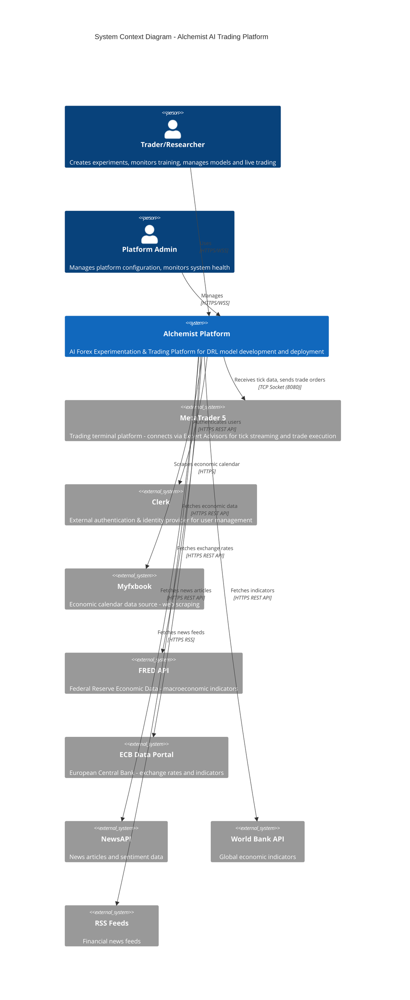
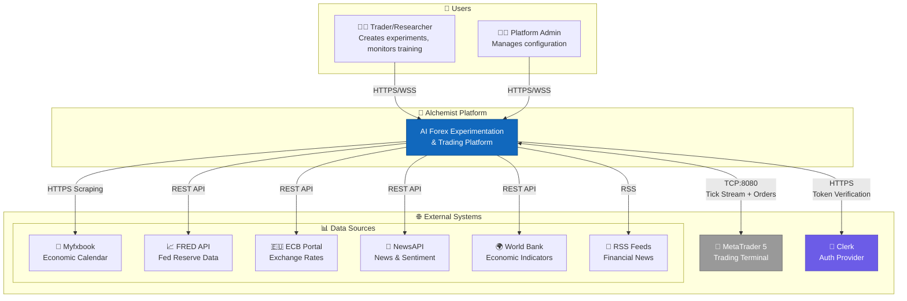

# C4 Level 1 - System Context Diagram

## Purpose
This diagram answers: **Who uses the Alchemist platform and what external systems does it interact with?**

## Scope
- **Includes**: All actors (users/systems) and external system boundaries
- **Excludes**: Internal container/component details

## Source of Truth References
| Element | Evidence Path |
|---------|---------------|
| MT5 EA Integration | `src/utils/MT5-EA/EAs/*.mq5`, `src/trading_server/src/server.py:337-463` |
| Clerk Authentication | `src/api/src/middleware/auth.py`, `src/dashboard/src/config/clerk.ts` |
| Myfxbook Scraping | `src/trading_server/src/web_scraper/web_scraper_myfxbook.py` |
| External Data APIs | `src/trading_server/src/connectors/fred_connector.py`, `src/trading_server/src/connectors/ecb_connector.py`, `src/trading_server/src/connectors/news_api_connector.py` |

## System Context Diagram

## Alternative Mermaid Flowchart (GitHub Compatible)

## Key Interactions

| From | To | Protocol | Purpose |
|------|-----|----------|---------|
| Trader/Admin | Alchemist | HTTPS/WSS | Web dashboard access, API calls, real-time updates |
| Alchemist | MetaTrader 5 | TCP Socket (8080) | Tick data streaming, trade order execution via Expert Advisors |
| Alchemist | Clerk | HTTPS REST | JWT token verification, user identity management |
| Alchemist | Myfxbook | HTTPS | Web scraping for economic calendar events |
| Alchemist | FRED/ECB/WorldBank | HTTPS REST | Macroeconomic data for feature engineering |
| Alchemist | NewsAPI/RSS | HTTPS | News and sentiment data for alternative data features |

## Assumptions
- **None** - All external integrations are verified in codebase

## Open Questions
- **None** - All actors and integrations are documented in code
