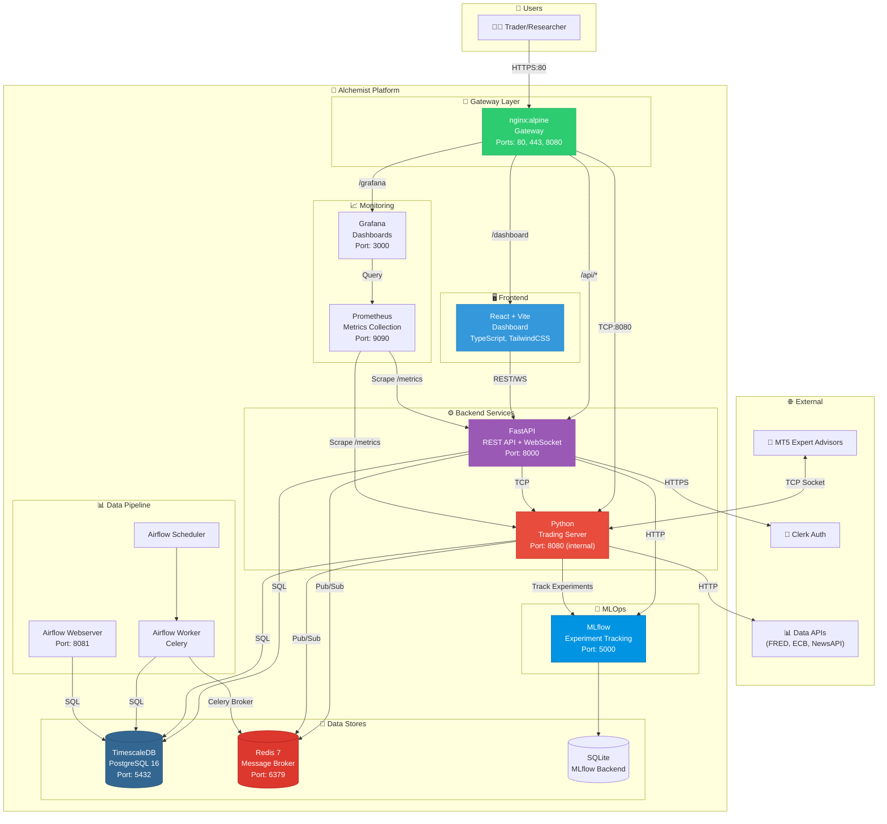

# C4 Level 2 - Container Diagram

## Purpose
This diagram answers: **What are the major deployable units (containers) of the Alchemist platform and how do they communicate?**

## Scope
- **Includes**: All Docker containers, databases, message brokers, and their interactions
- **Excludes**: Internal component details within each container

## Source of Truth References
| Container | Evidence Path |
|-----------|---------------|
| Gateway (nginx) | `docker-compose.yml:5-25`, `src/gateway/nginx.conf` |
| Dashboard (React) | `docker-compose.yml:189-211`, `src/dashboard/` |
| API (FastAPI) | `docker-compose.yml:144-184`, `src/api/src/main.py` |
| Trading Server | `docker-compose.yml:54-85`, `src/trading_server/src/server.py` |
| PostgreSQL + TimescaleDB | `docker-compose.yml:30-49`, `src/database/scripts/` |
| Redis | `docker-compose.yml:273-285` |
| MLflow | `docker-compose.yml:119-139` |
| Prometheus | `docker-compose.yml:216-242`, `src/monitoring/prometheus/` |
| Grafana | `docker-compose.yml:247-268`, `src/monitoring/grafana/` |
| Airflow (Scheduler, Webserver, Worker) | `docker-compose.yml:290-427` |

## Container Diagram

## Container Details

| Container | Technology | Port | Purpose |
|-----------|------------|------|---------|
| **Gateway** | nginx:alpine | 80, 443, 8080 | Reverse proxy, SSL termination, rate limiting, MT5 TCP proxy |
| **Dashboard** | React 18 + Vite + TypeScript | 80 (internal) | Web UI for experiments, models, trading, performance |
| **API** | FastAPI + Python 3.11 | 8000 | REST API, WebSocket channels, Clerk auth integration |
| **Trading Server** | Python 3.11 | 8080 (internal) | MT5 connection management, experiment runner, DRL training |
| **PostgreSQL** | TimescaleDB (PG 16) | 5432 | Time-series data, experiments, models, accounts |
| **Redis** | Redis 7 Alpine | 6379 | Celery broker, pub/sub alerts, caching |
| **MLflow** | MLflow 2.10 | 5000 | Experiment tracking, model registry, artifacts |
| **Prometheus** | Prometheus | 9090 | Metrics collection and alerting |
| **Grafana** | Grafana | 3000 | Monitoring dashboards |
| **Airflow Webserver** | Apache Airflow 2.8 | 8081 | DAG management UI |
| **Airflow Scheduler** | Apache Airflow 2.8 | - | DAG scheduling |
| **Airflow Worker** | Apache Airflow 2.8 + Celery | - | Task execution |

## Communication Protocols

| From | To | Protocol | Description |
|------|-----|----------|-------------|
| Gateway → Dashboard | HTTP | Static file serving, SPA routing |
| Gateway → API | HTTP | REST API proxying with /api prefix |
| Gateway → Server | TCP Stream | MT5 EA connection proxying |
| Dashboard → API | HTTP/WSS | REST calls and WebSocket subscriptions |
| API → Server | TCP Socket | Internal trading server communication |
| API/Server → Postgres | PostgreSQL | Primary data persistence |
| API/Server → Redis | Redis Protocol | Pub/sub for real-time alerts |
| Server → MLflow | HTTP | Experiment logging, model artifacts |
| Airflow → Redis | Redis/Celery | Task queue and results |

## Volume Mounts

| Service | Volume | Purpose |
|---------|--------|---------|
| Postgres | `postgres_data` | Persistent database storage |
| MLflow | `mlflow_data` | Experiment data and artifacts |
| Redis | `redis_data` | Persistent message queue |
| Prometheus | `prometheus_data` | Metrics time-series data |
| Grafana | `grafana_data` | Dashboard configurations |
| Trading Server | `./logs`, `./models` | Log files and model checkpoints |

## Assumptions
- **None** - All containers verified in `docker-compose.yml`
