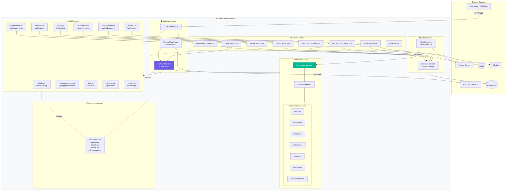

# C4 Level 3 - API Container Components

## Purpose
This diagram answers: **What are the internal components of the FastAPI REST API service and how do they collaborate?**

## Scope
- **Includes**: Routers, services, middleware, WebSocket handlers, database access
- **Excludes**: Implementation details within individual components

## Source of Truth References
| Component | Evidence Path |
|-----------|---------------|
| Main Application | `src/api/src/main.py` |
| Routers | `src/api/src/routers/*.py` |
| Services | `src/api/src/services/*.py` |
| Middleware | `src/api/src/middleware/auth.py`, `src/api/src/middleware/metrics.py` |
| WebSocket | `src/api/src/websocket/manager.py`, `src/api/src/websocket/channels.py` |
| Schemas | `src/api/src/schemas/*.py` |
| Database | `src/api/src/database/*.py` |
| Config | `src/api/src/config.py` |

## Component Diagram

## Component Details

### Middleware Layer
| Component | File | Responsibility |
|-----------|------|----------------|
| CORS | `main.py` (inline) | Cross-origin request handling |
| Metrics | `middleware/metrics.py` | Prometheus metrics collection |
| Auth | `middleware/auth.py` | Clerk JWT token verification |

### REST Routers (all prefixed with `/api`)
| Router | File | Endpoints |
|--------|------|-----------|
| Health | `health.py` | `/health`, `/ready` |
| Features | `features.py` | GET/POST `/features`, feature catalog |
| Experiments | `experiments.py` | CRUD `/experiments`, start/stop/clone |
| Hyperparameters | `hyperparameters.py` | Optuna search management |
| Models | `models.py` | Model registry, promotion, paper sessions |
| Trading | `trading.py` | Trading status, kill switch, circuit breaker |
| Performance | `performance.py` | Portfolio/model metrics, equity curves |
| MT5 Accounts | `mt5_accounts.py` | Account registration, assignment |
| Data | `data.py` | Data access and queries |
| Schema | `schema.py` | Schema registry |
| Lineage | `lineage.py` | Data lineage tracking |

### WebSocket Channels
| Channel | Purpose |
|---------|---------|
| `/ws/ticks` | Real-time tick data streaming |
| `/ws/training` | Training metrics updates |
| `/ws/optuna` | Hyperparameter search progress |
| `/ws/positions` | Open positions updates |
| `/ws/alerts` | System alerts and notifications |
| `/ws/models` | Model lifecycle updates |
| `/ws/accounts/mt5` | MT5 connection status |
| `/ws/performance` | Performance metrics updates |

### Services
| Service | Responsibility |
|---------|----------------|
| `experiment_service` | Experiment CRUD, status management |
| `feature_service` | Feature catalog queries |
| `model_service` | Model registry, promotion workflow |
| `trading_service` | Kill switch, circuit breaker, positions |
| `performance_service` | Metrics calculation, equity curves |
| `mt5_accounts_service` | Account lifecycle, model assignments |
| `clerk_service` | Clerk API integration |
| `database` | Database session management |

## Data Flow
1. **Request arrives** → CORS → Metrics → Auth middleware
2. **Auth verifies** JWT with Clerk → extracts user_id and roles
3. **Router handles** request → calls appropriate service
4. **Service executes** business logic → queries database
5. **Response returned** via Pydantic schema validation

## Assumptions
- **None** - All components verified in source code
