# C4 Level 3 - Trading Server Components

## Purpose
This diagram answers: **What are the internal components of the Trading Server and how do they collaborate for data ingestion, experiment training, and trade execution?**

## Scope
- **Includes**: Core modules, connectors, agents, experiments, MLOps, infrastructure
- **Excludes**: Line-by-line implementation details

## Source of Truth References
| Component | Evidence Path |
|-----------|---------------|
| Server Core | `src/trading_server/src/server.py` |
| Connectors | `src/trading_server/src/connectors/*.py` |
| Agents | `src/trading_server/src/agents/*.py` |
| Experiments | `src/trading_server/src/experiments/*.py` |
| Training | `src/trading_server/src/training/*.py` |
| MLOps | `src/trading_server/src/mlops/*.py` |
| Infrastructure | `src/trading_server/src/infrastructure/` |
| Features | `src/trading_server/src/features/` |
| Risk Management | `src/trading_server/src/risk/*.py` |
| Trading | `src/trading_server/src/trading/*.py` |
| MT5 Connection | `src/trading_server/src/mt5_connection/*.py` |

## Component Diagram

```mermaid
flowchart TB
    subgraph External["External Systems"]
        MT5EA["MT5 Expert Advisors"]
        DataAPIs["External Data APIs"]
        Postgres[("PostgreSQL")]
        Redis[("Redis")]
        MLflow["MLflow Server"]
    end

    subgraph TradingServerContainer["🖥️ Trading Server Container"]
        subgraph Core["🔌 Core Socket Server"]
            Server["server.py<br/>Socket Server<br/>MT5 Authentication"]
            HTTPController["http_controller.py<br/>Prometheus /metrics"]
        end

        subgraph MT5Connection["📡 MT5 Connection Layer"]
            TickStreamer["MT5TickStreamer<br/>Tick data receiver"]
            Terminal["MT5Terminal<br/>Trade execution"]
        end

        subgraph Connectors["🔗 Data Connectors"]
            ConnectorRegistry["Connector Registry"]
            MT5PriceConnector["MT5PriceConnector"]
            FREDConnector["FREDConnector"]
            ECBConnector["ECBConnector"]
            NewsAPIConnector["NewsAPIConnector"]
            WorldBankConnector["WorldBankConnector"]
            WebScrapingConnector["WebScrapingConnector"]
            RSSConnector["RSSFeedConnector"]
        end

        subgraph Features["🧮 Feature Engineering"]
            FeatureCatalog["Feature Catalog"]
            FeatureComputer["Feature Computer"]
            Contracts["Data Contracts"]
        end

        subgraph Experiments["🧪 Experiment System"]
            ExperimentBuilder["Experiment Builder"]
            ExperimentRunner["Experiment Runner"]
            OptunaTuner["Optuna Hyperparameter Tuner"]
        end

        subgraph Agents["🤖 DRL Agents"]
            TradingAgent["Trading Agent<br/>(Base)"]
            DQNAgent["DQN Agent"]
            AttentionDQNAgent["Attention DQN Agent"]
            RLTradingAgent["RL Trading Agent"]
        end

        subgraph Training["📚 Training"]
            TrainingLoop["Training Loop"]
            LRScheduler["LR Scheduler"]
            SumTree["Priority Replay"]
        end

        subgraph Environments["🌍 Trading Environments"]
            LiveEnv["Live Trading Env"]
            HistoricalEnv["Historical Env"]
        end

        subgraph RiskManagement["⚠️ Risk Management"]
            RiskManager["Risk Manager"]
            KillSwitch["Kill Switch"]
            CircuitBreaker["Circuit Breaker"]
            PositionSizer["Position Sizer"]
        end

        subgraph Trading["💹 Trading Execution"]
            TradingController["Trading Controller"]
            OrderManager["Order Manager"]
            BrokerAdapter["MT5 Broker Adapter"]
        end

        subgraph MLOpsModule["📊 MLOps"]
            ExperimentTracker["Experiment Tracker<br/>(MLflow)"]
            DataVersioner["Data Versioner<br/>(DVC)"]
            ModelRegistry["Model Registry"]
        end

        subgraph Infrastructure["🏗️ Infrastructure"]
            subgraph DataPipeline["Data Pipeline"]
                CeleryApp["Celery App"]
                AirflowDAGs["Airflow DAGs"]
            end
            subgraph DataQuality["Data Quality"]
                DriftDetector["Drift Detector"]
                DistributionCollector["Distribution Collector"]
            end
            subgraph Factories["Factories"]
                AgentFactory["Agent Factory"]
                EnvFactory["Environment Factory"]
                RiskFactory["Risk Manager Factory"]
            end
            AlertPublisher["Alert Publisher"]
            SchemaRegistry["Schema Registry"]
            LineageService["Lineage Service"]
        end

        subgraph Database["💾 Database Layer"]
            DatabaseConn["Database Connection"]
            DBIntegration["DB Integration"]
        end
    end

    %% External connections
    MT5EA <-->|"TCP Socket"| Server
    DataAPIs --> Connectors
    DatabaseConn --> Postgres
    AlertPublisher --> Redis
    ExperimentTracker --> MLflow

    %% Core to MT5
    Server --> TickStreamer
    Server --> Terminal

    %% MT5 to Connectors
    TickStreamer --> MT5PriceConnector
    MT5PriceConnector --> ConnectorRegistry

    %% Connectors to Features
    ConnectorRegistry --> FeatureCatalog
    FeatureCatalog --> FeatureComputer

    %% Experiments orchestration
    ExperimentBuilder --> Features
    ExperimentBuilder --> ExperimentRunner
    ExperimentRunner --> OptunaTuner

    %% Runner to Agents/Envs
    ExperimentRunner --> AgentFactory
    AgentFactory --> Agents
    ExperimentRunner --> EnvFactory
    EnvFactory --> Environments

    %% Training flow
    Agents --> Training
    Training --> Environments
    Training --> ExperimentTracker

    %% Risk and Trading
    Trading --> RiskManagement
    Trading --> BrokerAdapter
    BrokerAdapter --> Terminal

    %% Infrastructure support
    Factories --> RiskFactory
    RiskFactory --> RiskManager
    DataQuality --> FeatureCatalog
    DataPipeline --> Connectors

    %% Database access
    FeatureCatalog --> DatabaseConn
    ExperimentRunner --> DatabaseConn
    DBIntegration --> DatabaseConn

    style TradingServerContainer fill:#f8f9fa,stroke:#dee2e6
    style Server fill:#e74c3c,stroke:#c0392b,color:#fff
    style ExperimentRunner fill:#9b59b6,stroke:#8e44ad,color:#fff
    style ExperimentTracker fill:#0194e2,stroke:#016bad,color:#fff
```

## Component Details

### Core Socket Server
| Component | File | Responsibility |
|-----------|------|----------------|
| Server | `server.py` | TCP socket server, MT5 authentication (streamer/terminal) |
| HTTPController | `http_controller.py` | Prometheus metrics endpoint |

### MT5 Connection Layer
| Component | File | Responsibility |
|-----------|------|----------------|
| MT5TickStreamer | `mt5_connection/tick_streamer.py` | Receive and process tick data |
| MT5Terminal | `mt5_connection/terminal.py` | Execute trades via MT5 EA |

### Data Connectors
| Connector | File | Data Source |
|-----------|------|-------------|
| ConnectorRegistry | `connectors/registry.py` | Central connector management |
| MT5PriceConnector | `connectors/mt5_price_connector.py` | Real-time MT5 prices |
| FREDConnector | `connectors/fred_connector.py` | Federal Reserve data |
| ECBConnector | `connectors/ecb_connector.py` | ECB exchange rates |
| NewsAPIConnector | `connectors/news_api_connector.py` | News articles |
| WorldBankConnector | `connectors/world_bank_connector.py` | Economic indicators |
| RSSFeedConnector | `connectors/rss_feed_connector.py` | RSS financial news |
| WebScrapingConnector | `connectors/web_scraping_connector.py` | Web scraping |

### Feature Engineering
| Component | File | Responsibility |
|-----------|------|----------------|
| FeatureCatalog | `features/catalog.py` | Feature discovery, metadata |
| Contracts | `data/contracts/*.py` | Data validation schemas |

### Experiment System
| Component | File | Responsibility |
|-----------|------|----------------|
| ExperimentBuilder | `experiments/builder.py` | Experiment configuration |
| ExperimentRunner | `experiments/runner.py` | Training orchestration |
| OptunaTuner | `experiments/optuna_tuner.py` | Hyperparameter search |

### DRL Agents
| Agent | File | Algorithm |
|-------|------|-----------|
| TradingAgent | `agents/trading_agent.py` | Base agent interface |
| DQNAgent | `agents/dqn_agent.py` | Deep Q-Network |
| AttentionDQNAgent | `agents/attention_dqn_agent.py` | DQN with attention |
| RLTradingAgent | `agents/rl_trading_agent.py` | General RL agent |

### Risk Management
| Component | File | Responsibility |
|-----------|------|----------------|
| RiskManager | `risk/risk_manager.py` | Risk calculations |
| KillSwitch | `risk/kill_switch.py` | Emergency stop |
| CircuitBreaker | `risk/circuit_breaker.py` | Auto-halt on losses |
| PositionSizer | `risk/position_sizer.py` | Position sizing |

### MLOps
| Component | File | Responsibility |
|-----------|------|----------------|
| ExperimentTracker | `mlops/experiment_tracker.py` | MLflow integration |
| DataVersioner | `mlops/data_versioner.py` | DVC integration |
| ModelRegistry | `mlops/model_registry.py` | Model versioning |

## Data Flow Summary
1. **MT5 EA connects** → Server authenticates → creates TickStreamer or Terminal
2. **Tick data flows** → MT5PriceConnector → ConnectorRegistry → FeatureCatalog
3. **Experiment starts** → ExperimentBuilder configures → ExperimentRunner orchestrates
4. **Training executes** → Agent + Environment loop → logs to MLflow
5. **Trade signal generated** → RiskManager validates → BrokerAdapter → Terminal → MT5

## Assumptions
- **None** - All components verified in source code
