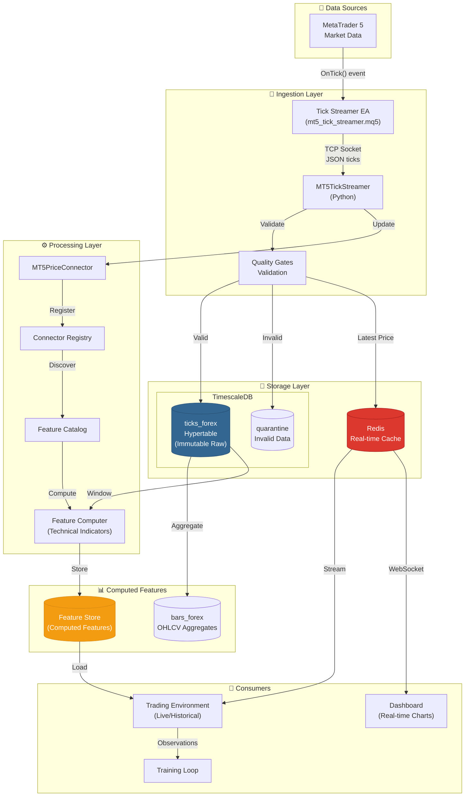

# Data Flow Diagram: Tick Data Pipeline

## Purpose
This diagram answers: **How does tick data flow from MT5 to storage, feature computation, and model consumption?**

## Scope
- **Includes**: Tick ingestion, storage, feature computation, model consumption
- **Excludes**: Trade execution (separate diagram)

## Source of Truth References
| Element | Evidence Path |
|---------|---------------|
| Tick Streamer | `src/trading_server/src/mt5_connection/tick_streamer.py` |
| Price Connector | `src/trading_server/src/connectors/mt5_price_connector.py` |
| Feature Catalog | `src/trading_server/src/features/catalog.py` |
| TimescaleDB Schema | `src/database/scripts/01_create.sql`, `src/database/scripts/01b_timescaledb_setup.sql` |
| Quality Gates | `src/trading_server/src/data/quality_gates.py` |

## Data Flow Diagram



## Detailed Data Transformations

### Stage 1: Raw Tick Ingestion
```
MT5 → EA → Streamer
```

| Field | Type | Example |
|-------|------|---------|
| datetime | TIMESTAMP | 2024-01-15 14:32:45.123 |
| bid | DOUBLE | 1.08542 |
| ask | DOUBLE | 1.08545 |
| volume | DOUBLE | 15.0 |
| symbol | STRING | EURUSD |

### Stage 2: Quality Validation
```
Raw Tick → Quality Gates → Valid/Invalid
```

| Check | Condition | Action |
|-------|-----------|--------|
| Timestamp | Not in future | Pass/Quarantine |
| Spread | < max_spread | Pass/Quarantine |
| Price | Within ±5 std | Pass/Quarantine |
| Duplicate | Unique (time, bid, ask) | Skip/Insert |

### Stage 3: Feature Computation
```
Ticks → Technical Indicators → Feature Store
```

| Feature Category | Examples |
|-----------------|----------|
| Price Features | bid, ask, spread, mid_price |
| OHLCV | open, high, low, close, volume (1m, 5m, 1h) |
| Technical | RSI, MACD, Bollinger Bands, EMA |
| Statistical | returns, volatility, skewness |
| Market | session (Asia/Europe/US), day_of_week |

## Storage Schema Details

### ticks_forex (TimescaleDB Hypertable)
```sql
-- Partitioned by time (monthly chunks)
CREATE TABLE ticks_forex (
    id BIGSERIAL,
    datetime TIMESTAMP NOT NULL,
    bid DOUBLE PRECISION NOT NULL,
    ask DOUBLE PRECISION NOT NULL,
    volume DOUBLE PRECISION,
    forex_pairs_id INT NOT NULL,
    created_at TIMESTAMP DEFAULT CURRENT_TIMESTAMP
);

-- Hypertable for time-series optimization
SELECT create_hypertable('ticks_forex', 'datetime');
```

### bars_forex (Aggregated OHLCV)
```sql
CREATE TABLE bars_forex (
    datetime TIMESTAMP NOT NULL,
    timeframe VARCHAR(10) NOT NULL, -- '1m', '5m', '1h', '1d'
    open DOUBLE PRECISION,
    high DOUBLE PRECISION,
    low DOUBLE PRECISION,
    close DOUBLE PRECISION,
    volume DOUBLE PRECISION,
    forex_pairs_id INT NOT NULL
);
```

## Timing and Latency

| Stage | Typical Latency | Notes |
|-------|-----------------|-------|
| MT5 → EA | < 1ms | Native MQL5 |
| EA → Streamer | 1-5ms | Network dependent |
| Validation | < 1ms | In-memory checks |
| DB Insert | 1-10ms | Batched inserts |
| Redis Publish | < 1ms | In-memory |
| Feature Compute | 10-50ms | Per window |

## Event Time vs Ingest Time

| Timestamp | Description | Usage |
|-----------|-------------|-------|
| `datetime` | **Event time** - when tick occurred in MT5 | Primary ordering |
| `created_at` | **Ingest time** - when stored in DB | Auditing, debugging |

**GMT+3 Timezone**: All MT5 timestamps are in server timezone (GMT+3)

## Deduplication Strategy

1. **Unique constraint**: (datetime, forex_pairs_id, bid, ask)
2. **Idempotency**: Same tick won't be inserted twice
3. **Gap detection**: Missing ticks logged for backfill

## Data Retention

| Table | Retention | Compression |
|-------|-----------|-------------|
| ticks_forex | 2 years raw | TimescaleDB native |
| bars_forex | Indefinite | Aggregated |
| quarantine | 30 days | None |

## Data Contracts

Location: `src/trading_server/src/data/contracts/`

```python
@dataclass
class TickContract:
    """Contract for tick data validation"""
    datetime: datetime  # Required, not null, not future
    bid: float         # Required, positive
    ask: float         # Required, > bid
    volume: float      # Optional, non-negative
    symbol: str        # Required, valid forex pair
```

## Assumptions
- **None** - All data flows verified in codebase
