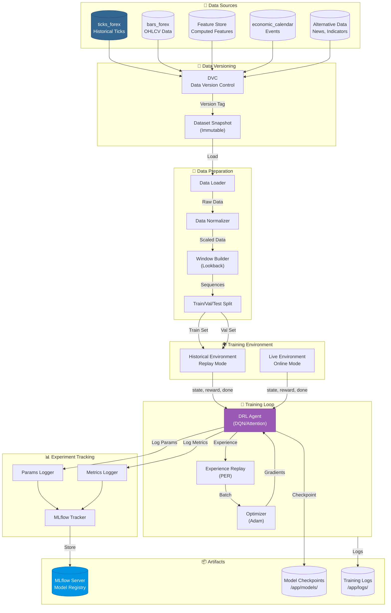

# Data Flow Diagram: Training Data Pipeline

## Purpose
This diagram answers: **How does data flow through the training pipeline from storage to model artifacts?**

## Scope
- **Includes**: Data loading, feature preparation, training loop, artifact storage
- **Excludes**: Initial data ingestion (separate diagram)

## Source of Truth References
| Element | Evidence Path |
|---------|---------------|
| Experiment Runner | `src/trading_server/src/experiments/runner.py` |
| Environment Factory | `src/trading_server/src/infrastructure/factories/environment_factory.py` |
| Historical Env | `src/trading_server/src/environments/historical_env.py` |
| Live Env | `src/trading_server/src/environments/live_env.py` |
| Experiment Tracker | `src/trading_server/src/mlops/experiment_tracker.py` |
| Data Versioner | `src/trading_server/src/mlops/data_versioner.py` |

## Training Data Flow Diagram



## Data Preparation Pipeline

### Step 1: Data Loading
```python
# Load historical data
loader.load(
    symbols=["EURUSD", "GBPUSD"],
    start_date="2023-01-01",
    end_date="2024-01-01",
    features=experiment.features
)
```

### Step 2: Normalization
| Method | Features | Formula |
|--------|----------|---------|
| Z-Score | Prices, indicators | (x - μ) / σ |
| Min-Max | Bounded features | (x - min) / (max - min) |
| Log | Returns, volumes | log(1 + x) |

### Step 3: Window Building
```python
# Create lookback windows
window_size = 50  # 50 timesteps
features_per_step = 20  # 20 features

# Shape: (num_samples, window_size, num_features)
X_train.shape = (100000, 50, 20)
```

### Step 4: Train/Val/Test Split
```
|-------- Train (70%) --------|-- Val (15%) --|-- Test (15%) --|
     Jan 2023 - Sep 2023       Oct 2023 - Nov   Dec 2023 - Jan
```

**Time-Series Split**: No random shuffling to prevent look-ahead bias

## Environment State Structure

### Historical Environment
```python
state = {
    "price_features": np.array([...]),      # (window_size, price_dim)
    "technical_features": np.array([...]),  # (window_size, tech_dim)
    "position": 0,  # -1 (short), 0 (flat), 1 (long)
    "balance": 10000.0,
    "unrealized_pnl": 0.0,
}
```

### Action Space
| Action | Description |
|--------|-------------|
| 0 | Hold / Do nothing |
| 1 | Buy / Long |
| 2 | Sell / Short |
| 3 | Close position |

### Reward Function
```python
reward = (
    realized_pnl * pnl_weight +
    position_held_penalty +
    risk_penalty +
    transaction_cost
)
```

## Experience Replay

### Prioritized Experience Replay (PER)
```python
# Priority based on TD error
priority = |δ| + ε  # TD error + small constant

# Sampling probability
P(i) = priority_i^α / Σ priority_j^α
```

| Parameter | Value | Description |
|-----------|-------|-------------|
| Buffer size | 100,000 | Max experiences stored |
| α | 0.6 | Prioritization exponent |
| β | 0.4 → 1.0 | Importance sampling |
| Batch size | 64 | Samples per update |

## MLflow Tracking

### Logged Parameters
```python
mlflow.log_params({
    "learning_rate": 0.001,
    "gamma": 0.99,
    "epsilon_start": 1.0,
    "epsilon_end": 0.01,
    "epsilon_decay": 0.995,
    "batch_size": 64,
    "hidden_size": 256,
    "num_layers": 3,
    "window_size": 50,
})
```

### Logged Metrics (per step/episode)
```python
mlflow.log_metrics({
    "loss": 0.025,
    "q_value": 5.2,
    "epsilon": 0.45,
    "episode_reward": 150.0,
    "episode_length": 1000,
    "sharpe_ratio": 1.5,
    "win_rate": 0.55,
    "max_drawdown": 0.08,
}, step=episode_num)
```

### Logged Artifacts
| Artifact | Path | Description |
|----------|------|-------------|
| Model | `model/` | Keras model files |
| Scaler | `scaler.pkl` | Feature scaler |
| Config | `config.json` | Experiment config |
| Metrics | `metrics.csv` | Training history |
| Plots | `plots/` | Visualizations |

## Data Versioning (DVC)

### dvc.yaml Pipeline
```yaml
stages:
  prepare_data:
    cmd: python scripts/prepare_data.py
    deps:
      - src/trading_server/src/features/
    outs:
      - data/processed/train.parquet
      - data/processed/val.parquet
      - data/processed/test.parquet
```

### Version Tracking
```python
# Logged to MLflow
mlflow.set_tag("data_version", "v2.3.1")
mlflow.set_tag("git_commit", "abc123")
mlflow.set_tag("dvc_hash", "def456")
```

## Reproducibility Metadata

| Metadata | Source | Logged As |
|----------|--------|-----------|
| Code commit | Git | `git_commit` tag |
| Data version | DVC | `data_version` tag |
| Config hash | params.yaml | `config_hash` param |
| Environment | Docker/venv | `environment_id` param |
| Random seed | Code | `random_seed` param |
| Requirements | requirements.txt | `requirements_hash` param |

## Assumptions
- **None** - All training flows verified in codebase
