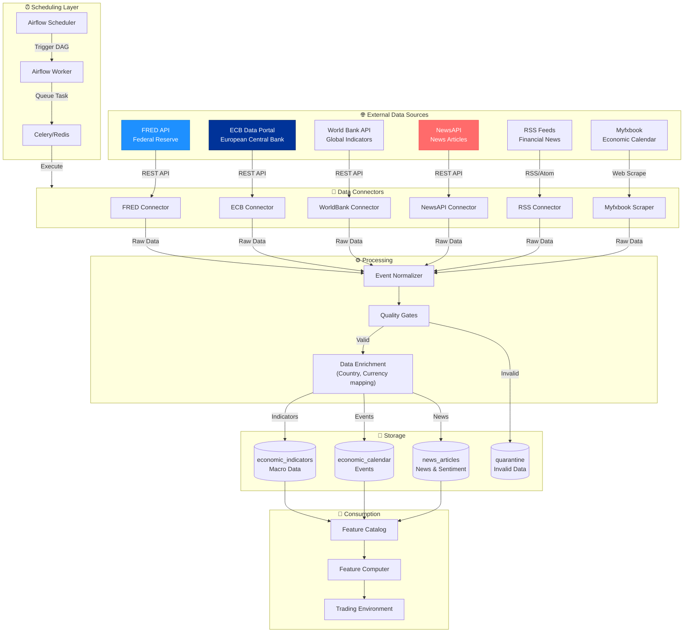

# Data Flow Diagram: Alternative Data Pipeline

## Purpose
This diagram answers: **How does alternative data (economic indicators, news, sentiment) flow through the platform?**

## Scope
- **Includes**: Economic data, news articles, RSS feeds, external API integration
- **Excludes**: Real-time tick data (separate diagram)

## Source of Truth References
| Element | Evidence Path |
|---------|---------------|
| FRED Connector | `src/trading_server/src/connectors/fred_connector.py` |
| ECB Connector | `src/trading_server/src/connectors/ecb_connector.py` |
| NewsAPI Connector | `src/trading_server/src/connectors/news_api_connector.py` |
| RSS Connector | `src/trading_server/src/connectors/rss_feed_connector.py` |
| WorldBank Connector | `src/trading_server/src/connectors/world_bank_connector.py` |
| Myfxbook Scraper | `src/trading_server/src/web_scraper/web_scraper_myfxbook.py` |
| Airflow DAGs | `src/trading_server/src/infrastructure/data_pipeline/airflow/dags/alternative_data_collection_dag.py` |
| Celery Tasks | `src/trading_server/src/infrastructure/data_pipeline/tasks/economic_data_tasks.py`, `src/trading_server/src/infrastructure/data_pipeline/tasks/news_data_tasks.py` |

## Alternative Data Flow Diagram



## Data Sources Detail

### FRED (Federal Reserve Economic Data)
| Indicator | Series ID | Frequency | Description |
|-----------|-----------|-----------|-------------|
| GDP | GDP | Quarterly | Gross Domestic Product |
| CPI | CPIAUCSL | Monthly | Consumer Price Index |
| Unemployment | UNRATE | Monthly | Unemployment Rate |
| Fed Funds Rate | FEDFUNDS | Monthly | Federal Funds Rate |
| 10Y Treasury | DGS10 | Daily | 10-Year Treasury Rate |

### ECB Data Portal
| Indicator | Key | Frequency | Description |
|-----------|-----|-----------|-------------|
| EUR/USD Rate | EXR.D.USD.EUR.SP00.A | Daily | Official exchange rate |
| ECB Interest Rate | FM.B.U2.EUR.4F.KR.MRR_RT.LEV | - | Main refinancing rate |
| HICP Inflation | ICP.M.U2.N.000000.4.ANR | Monthly | Harmonized CPI |

### Myfxbook Economic Calendar
| Field | Description |
|-------|-------------|
| datetime | Event time (UTC) |
| event | Event name |
| impact | 1=Low, 2=Medium, 3=High |
| country | Country code |
| previous | Previous value |
| consensus | Expected value |
| actual | Actual value (post-release) |

### News Sources
| Source | Type | Update Frequency |
|--------|------|------------------|
| NewsAPI | REST API | Hourly |
| RSS Feeds | XML Feed | Every 15 mins |
| Bloomberg RSS | XML Feed | Real-time |
| Reuters RSS | XML Feed | Real-time |

## Collection Schedule

```mermaid
gantt
    title Alternative Data Collection Schedule
    dateFormat HH:mm
    axisFormat %H:%M
    
    section Economic
    FRED Daily Data      :a1, 06:00, 30m
    ECB Exchange Rates   :a2, 06:30, 30m
    WorldBank Indicators :a3, after a2, 30m
    
    section Calendar
    Myfxbook Scrape      :b1, 17:10, 20m
    
    section News
    NewsAPI Hourly       :c1, 00:00, 24h
    RSS Feed Check       :c2, 00:00, 24h
```



## Database Schema

### economic_indicators
```sql
CREATE TABLE economic_indicators (
    id SERIAL PRIMARY KEY,
    indicator_code VARCHAR(50) NOT NULL,
    source VARCHAR(50) NOT NULL,      -- 'fred', 'ecb', 'worldbank'
    value DOUBLE PRECISION,
    datetime TIMESTAMP NOT NULL,
    country_code VARCHAR(3),
    created_at TIMESTAMP DEFAULT NOW()
);

CREATE INDEX idx_econ_ind_code ON economic_indicators(indicator_code, datetime);
```

### economic_calendar
```sql
CREATE TABLE economic_calendar (
    id BIGSERIAL NOT NULL,
    datetime TIMESTAMP NOT NULL,
    event VARCHAR(250) NOT NULL,
    impact INT NOT NULL,               -- 1, 2, 3
    previous VARCHAR(20),
    consensus VARCHAR(20),
    actual VARCHAR(20),
    country_id INT NOT NULL,
    created_at TIMESTAMP DEFAULT NOW()
);
```

### news_articles
```sql
CREATE TABLE news_articles (
    id SERIAL PRIMARY KEY,
    title TEXT NOT NULL,
    content TEXT,
    source VARCHAR(100),
    url TEXT,
    published_at TIMESTAMP,
    sentiment_score DOUBLE PRECISION,  -- -1 to 1
    relevance_score DOUBLE PRECISION,  -- 0 to 1
    keywords JSONB,
    created_at TIMESTAMP DEFAULT NOW()
);

CREATE INDEX idx_news_published ON news_articles(published_at);
CREATE INDEX idx_news_source ON news_articles(source);
```

## Feature Derivation

### From Economic Indicators
| Feature | Computation | Window |
|---------|-------------|--------|
| `gdp_growth_rate` | (GDP_t - GDP_t-4) / GDP_t-4 | Quarterly |
| `inflation_yoy` | (CPI_t - CPI_t-12) / CPI_t-12 | Monthly |
| `rate_differential` | US_rate - EU_rate | Current |
| `yield_curve_slope` | 10Y_rate - 2Y_rate | Current |

### From Economic Calendar
| Feature | Computation | Window |
|---------|-------------|--------|
| `high_impact_upcoming` | Count events (impact=3) in next 24h | Rolling |
| `surprise_factor` | (actual - consensus) / |consensus| | Per event |
| `event_volatility` | Std dev of surprises | Rolling 30d |

### From News
| Feature | Computation | Window |
|---------|-------------|--------|
| `news_sentiment` | Avg sentiment score | Rolling 1h |
| `news_volume` | Count articles | Rolling 1h |
| `sentiment_momentum` | sentiment_1h - sentiment_24h | Differential |

## Connector Interface

All connectors implement `IDataSourceConnector`:

```python
class FREDConnector(IDataSourceConnector):
    def backfill(self, start_time, end_time) -> Iterator[Dict]:
        """Fetch historical data from FRED API"""
        
    def get_schema(self) -> Dict:
        return {
            "indicator_code": str,
            "value": float,
            "datetime": datetime,
            "source": "fred"
        }
```

## Error Handling

| Error | Handling | Retry |
|-------|----------|-------|
| Rate limit (429) | Exponential backoff | 3 attempts |
| API timeout | Log and continue | Next schedule |
| Invalid data | Quarantine | None |
| Parse error | Log and skip | None |

## Assumptions
- **None** - All alternative data flows verified in codebase
