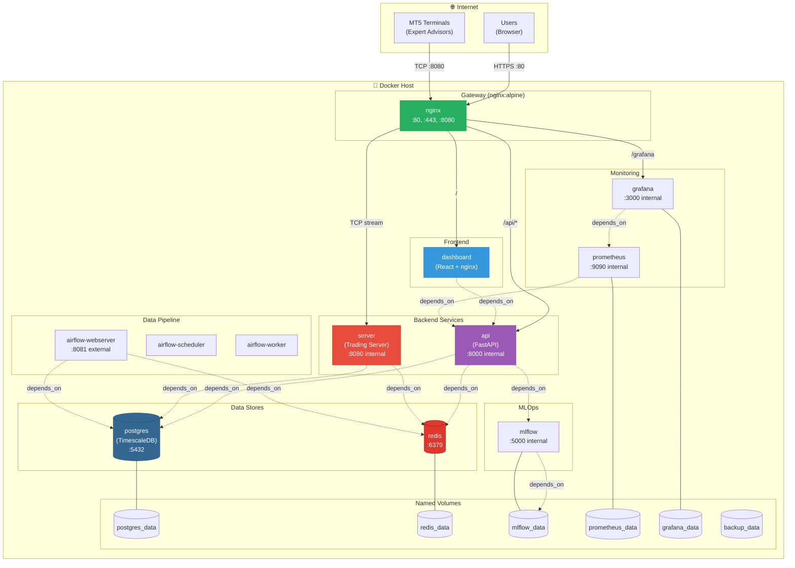
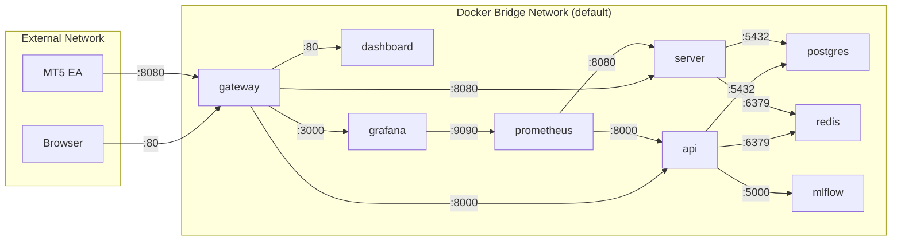
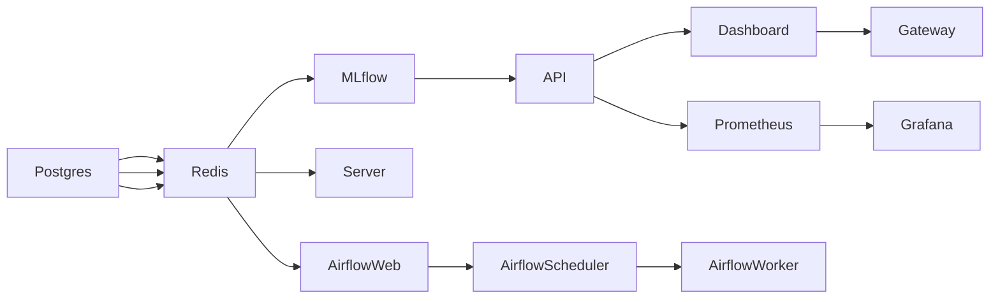

# Deployment View

## Purpose
This document answers: **How is the Alchemist platform deployed and what runs where?**

## Scope
- **Includes**: Docker Compose topology, environment configurations, secrets management
- **Excludes**: Cloud-specific configurations (AWS, GCP, Azure)

## Source of Truth References
| Element | Evidence Path |
|---------|---------------|
| Docker Compose | `docker-compose.yml` |
| Gateway Config | `src/gateway/nginx.conf`, `src/gateway/conf.d/` |
| Prometheus Config | `src/monitoring/prometheus/prometheus.yml` |
| Grafana Provisioning | `src/monitoring/grafana/provisioning/` |
| Database Scripts | `src/database/scripts/` |
| Dockerfiles | `src/api/Dockerfile`, `src/trading_server/Dockerfile`, `src/dashboard/Dockerfile` |

## Deployment Diagram



## What Runs Where Table

| Service | Container Name | Image | Ports Exposed | Volumes | Replicas |
|---------|----------------|-------|---------------|---------|----------|
| **Gateway** | gateway | nginx:alpine | 80, 443, 8080 | `./src/gateway/`, `./logs/gateway/` | 1 |
| **Dashboard** | dashboard | Custom (React+nginx) | - (internal 80) | - | 1 |
| **API** | api | Custom (FastAPI) | - (internal 8000) | `./logs/` | 1 |
| **Trading Server** | server | Custom (Python) | - (internal 8080) | `./logs/`, `./models/` | 1 |
| **PostgreSQL** | postgres | timescale/timescaledb:latest-pg16 | 5432 (dev only) | `postgres_data` | 1 |
| **Redis** | redis | redis:7-alpine | - (internal 6379) | `redis_data` | 1 |
| **MLflow** | mlflow | ghcr.io/mlflow/mlflow:v2.10.0 | - (internal 5000) | `mlflow_data` | 1 |
| **Prometheus** | prometheus | prom/prometheus:latest | - (internal 9090) | `prometheus_data` | 1 |
| **Grafana** | grafana | grafana/grafana:latest | - (internal 3000) | `grafana_data` | 1 |
| **Airflow Webserver** | airflow-webserver | apache/airflow:2.8.0 | 8081 | `./airflow_logs/` | 1 |
| **Airflow Scheduler** | airflow-scheduler | apache/airflow:2.8.0 | - | `./airflow_logs/` | 1 |
| **Airflow Worker** | airflow-worker | apache/airflow:2.8.0 | - | `./airflow_logs/` | 1 |
| **Backup** | db_backup | postgres:16 | - | `backup_data` | On-demand |

## Environment Configurations

### Development Environment

```bash
# Exposed ports for development
- Postgres: 5432 (direct access)
- Airflow: 8081 (web UI)
- All services: localhost access

# Debug settings
LOG_LEVEL=DEBUG
```

### Production Environment

```bash
# Only gateway exposed
- Gateway: 80, 443, 8080
- All other services: internal only

# Security
- Remove Postgres port exposure
- Enable HTTPS on gateway
- Rotate secrets regularly
```

## Port Mapping Summary

| External Port | Service | Protocol | Purpose |
|---------------|---------|----------|---------|
| **80** | Gateway → Dashboard/API | HTTP/HTTPS | Web access |
| **443** | Gateway | HTTPS | Secure web (future) |
| **8080** | Gateway → Server | TCP | MT5 EA connections |
| **8081** | Airflow (direct) | HTTP | Airflow UI |
| **5432** | Postgres (dev only) | PostgreSQL | Direct DB access |

## Network Topology



## Health Checks

| Service | Health Check Command | Interval | Timeout | Retries |
|---------|---------------------|----------|---------|---------|
| Gateway | `wget --spider http://127.0.0.1/gateway/health` | 30s | 10s | 3 |
| API | `curl -f http://127.0.0.1:8000/health` | 30s | 10s | 5 |
| Dashboard | `wget --spider http://127.0.0.1/health` | 30s | 10s | 3 |
| Postgres | `pg_isready -U $DB_USER -d $DB_NAME` | 10s | 5s | 5 |
| Redis | `redis-cli ping` | 10s | 5s | 5 |
| MLflow | Python urllib check | 30s | 10s | 3 |
| Prometheus | `wget --spider http://127.0.0.1:9090/-/healthy` | 30s | 10s | 3 |
| Grafana | `wget --spider http://localhost:3000/api/health` | 30s | 10s | 3 |
| Airflow | `curl --fail http://localhost:8081/health` | 30s | 10s | 5 |

## Startup Order (Dependency Chain)



1. **Postgres** - Database must be healthy first
2. **Redis** - Message broker for Celery
3. **MLflow** - Experiment tracking (can fail gracefully)
4. **API** - REST API and WebSocket
5. **Server** - Trading server
6. **Dashboard** - Frontend (depends on API)
7. **Gateway** - Entry point (depends on Dashboard, API)
8. **Prometheus** - Metrics collection (depends on API)
9. **Grafana** - Dashboards (depends on Prometheus)
10. **Airflow** - Data pipelines (depends on Postgres, Redis)

## Volume Management

### Persistent Volumes
```yaml
volumes:
  postgres_data:    # Database files
  backup_data:      # Database backups
  mlflow_data:      # MLflow experiments and artifacts
  prometheus_data:  # Metrics time-series
  grafana_data:     # Dashboard configurations
  redis_data:       # Redis persistence (AOF)
```

### Bind Mounts
```yaml
- ./logs:/app/logs              # Application logs (both API and Server)
- ./models:/app/models          # Model checkpoints
- ./src/gateway/:/etc/nginx/    # Nginx configuration
- ./src/database/scripts/:/docker-entrypoint-initdb.d/  # DB init scripts
```

## Secrets Management

| Secret | Location | Usage |
|--------|----------|-------|
| `DB_PASSWORD` | `.env` | Database password |
| `CLERK_SECRET_KEY` | `.env` | Clerk API authentication |
| `STREAMER_AUTH_TOKEN` | `.env` | MT5 tick streamer auth |
| `AIRFLOW_FERNET_KEY` | `.env` | Airflow encryption |
| `GF_SECURITY_ADMIN_PASSWORD` | `.env` | Grafana admin |

### Production Recommendations
1. Use Docker secrets or external secret manager
2. Never commit `.env` to version control
3. Rotate secrets regularly
4. Use different secrets per environment

## Scaling Considerations

| Service | Scalable? | Notes |
|---------|-----------|-------|
| Gateway | ✅ Yes | Load balancer in front |
| Dashboard | ✅ Yes | Stateless, CDN recommended |
| API | ⚠️ Limited | Sticky sessions for WebSocket |
| Server | ❌ No | Single instance required (stateful) |
| Postgres | ⚠️ Limited | Read replicas possible |
| Redis | ✅ Yes | Cluster mode |

## Assumptions
- **None** - All deployment configurations verified in codebase
