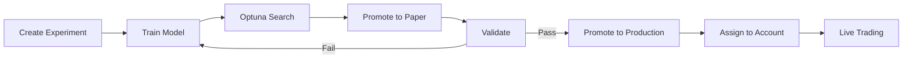

# Alchemist Platform - Architecture Documentation

> **AI Forex Experimentation & Trading Platform**
> 
> Complete architecture documentation using C4 Model and arc42-style views

## 📋 Quick Navigation

| I want to understand... | Start here |
|------------------------|------------|
| What the system does and who uses it | [C4 Level 1 - System Context](#c4-structural-diagrams) |
| What containers/services exist | [C4 Level 2 - Container Diagram](#c4-structural-diagrams) |
| How the API is organized internally | [C4 Level 3 - API Components](#c4-structural-diagrams) |
| How user authentication works | [Authentication Flow](#runtime-scenarios) |
| How MT5 connects to the platform | [MT5 Connection Flow](#runtime-scenarios) |
| How data flows through the system | [Data Flow Diagrams](#data-flow-diagrams) |
| How to deploy the platform | [Deployment View](#deployment-view) |
| Why certain decisions were made | [Architecture Decisions](#architecture-decisions) |

---

## 📊 Service Inventory

### Service Catalog

| Service | Type | Runtime | Port | Dependencies |
|---------|------|---------|------|--------------|
| **Gateway** | Reverse Proxy | nginx:alpine | 80, 443, 8080 | Dashboard, API |
| **Dashboard** | Web UI | React 18 + Vite | 80 (internal) | API |
| **API** | REST + WebSocket | FastAPI (Python 3.11) | 8000 | Postgres, Redis, MLflow |
| **Trading Server** | Socket Server | Python 3.11 | 8080 | Postgres, Redis |
| **PostgreSQL** | Database | TimescaleDB (PG16) | 5432 | - |
| **Redis** | Message Broker | Redis 7 | 6379 | - |
| **MLflow** | ML Tracking | MLflow 2.10 | 5000 | SQLite |
| **Prometheus** | Metrics | Prometheus | 9090 | API, Server |
| **Grafana** | Dashboards | Grafana | 3000 | Prometheus |
| **Airflow** | Pipelines | Airflow 2.8 | 8081 | Postgres, Redis |

### External Dependencies

| System | Purpose | Protocol |
|--------|---------|----------|
| MetaTrader 5 | Tick data, trade execution | TCP Socket |
| Clerk | User authentication | HTTPS REST |
| FRED | Economic data | HTTPS REST |
| ECB | Exchange rates | HTTPS REST |
| NewsAPI | News articles | HTTPS REST |
| Myfxbook | Economic calendar | Web scraping |

---

## 🏗️ C4 Structural Diagrams

### Level 1 - System Context
**Question answered**: Who uses the system and what external systems does it interact with?

📄 [c4/c4-level1-system-context.md](c4/c4-level1-system-context.md)

```
Traders/Researchers → Alchemist Platform → MT5, Clerk, Data APIs
```

### Level 2 - Container Diagram
**Question answered**: What are the major deployable units and how do they communicate?

📄 [c4/c4-level2-container.md](c4/c4-level2-container.md)

```
Gateway → Dashboard → API → Trading Server → PostgreSQL/Redis
           ↓           ↓
         MLflow    Prometheus/Grafana
```

### Level 3 - Component Diagrams

#### API Container
**Question answered**: What are the internal components of the FastAPI service?

📄 [c4/c4-level3-api-components.md](c4/c4-level3-api-components.md)

- Middleware (CORS, Auth, Metrics)
- Routers (11 REST endpoints)
- WebSocket Channels (12 channels)
- Services (business logic)

#### Trading Server Container
**Question answered**: What are the internal components of the Trading Server?

📄 [c4/c4-level3-trading-server-components.md](c4/c4-level3-trading-server-components.md)

- Socket Server & MT5 Connection
- Data Connectors (7 sources)
- Experiment System
- DRL Agents
- Risk Management

---

## 🔄 Runtime Scenarios

### Key User Flows

| # | Scenario | Diagram |
|---|----------|---------|
| 1 | **User Authentication** | [01-user-authentication-flow.md](runtime/01-user-authentication-flow.md) |
| 2 | **MT5 EA Connection** | [02-mt5-connection-flow.md](runtime/02-mt5-connection-flow.md) |
| 3 | **Experiment Training** | [03-experiment-training-flow.md](runtime/03-experiment-training-flow.md) |
| 4 | **Model Promotion** | [04-model-promotion-flow.md](runtime/04-model-promotion-flow.md) |
| 5 | **Trade Execution** | [05-trade-execution-flow.md](runtime/05-trade-execution-flow.md) |
| 6 | **Data Ingestion** | [06-data-ingestion-flow.md](runtime/06-data-ingestion-flow.md) |
| 7 | **WebSocket Updates** | [07-websocket-realtime-updates.md](runtime/07-websocket-realtime-updates.md) |
| 8 | **Optuna Search** | [08-optuna-hyperparameter-search.md](runtime/08-optuna-hyperparameter-search.md) |

### Critical Path: Experiment to Production



---

## 📈 Data Flow Diagrams

| Diagram | Purpose |
|---------|---------|
| [01-tick-data-flow.md](dataflows/01-tick-data-flow.md) | MT5 → TimescaleDB → Features → Environment |
| [02-training-data-flow.md](dataflows/02-training-data-flow.md) | Storage → Preparation → Training → MLflow |
| [03-alternative-data-flow.md](dataflows/03-alternative-data-flow.md) | External APIs → Airflow → Storage |

### Storage Lineage

```
MT5 Ticks → ticks_forex (raw) → bars_forex (OHLCV) → features (computed)
                                                           ↓
FRED/ECB → economic_indicators ────────────────────→ Feature Catalog
                                                           ↓
NewsAPI → news_articles ────────────────────────────→ Environment
```

---

## 👤 User Journeys

| Persona | Journey |
|---------|---------|
| **Trader/Researcher** | [01-trader-journey.md](user-flows/01-trader-journey.md) |
| **Platform Admin** | [02-admin-journey.md](user-flows/02-admin-journey.md) |

### Trader Journey Summary
```
Sign In → Register MT5 → Build Experiment → Train → Optimize → 
Paper Trade → Validate → Production → Monitor
```

---

## 🚀 Deployment View

📄 [deployment/deployment-view.md](deployment/deployment-view.md)

### Quick Start
```bash
# Clone and configure
git clone <repo>
cp .env.example .env
# Edit .env with your settings

# Start all services
docker compose up -d

# Access
# Dashboard: http://localhost
# API Docs: http://localhost/api/docs
# Grafana: http://localhost/grafana
```

### Environment Summary

| Environment | Gateway Ports | Database | Notes |
|-------------|---------------|----------|-------|
| **Development** | 80, 8080 | 5432 exposed | Debug logging |
| **Production** | 80, 443, 8080 | Internal only | SSL enabled |

---

## 📝 Architecture Decisions

📄 [decisions/architecture-decisions.md](decisions/architecture-decisions.md)

### Key Decisions

| ADR | Decision | Rationale |
|-----|----------|-----------|
| ADR-001 | Microservices with Docker Compose | Service isolation, tech flexibility |
| ADR-002 | TimescaleDB for time-series | Hypertables, compression |
| ADR-003 | Clerk for authentication | Security, features, speed |
| ADR-004 | MLflow for ML tracking | Industry standard, model registry |
| ADR-005 | TCP Socket for MT5 | Low latency, bidirectional |
| ADR-006 | Redis for messaging | Celery + pub/sub in one |
| ADR-009 | Model lifecycle stages | Safe promotion workflow |
| ADR-010 | TOTP for sensitive ops | Extra security layer |

---

## 📁 Diagram Files Index

### C4 Diagrams
```
c4/
├── c4-level1-system-context.md
├── c4-level2-container.md
├── c4-level3-api-components.md
└── c4-level3-trading-server-components.md
```

### Runtime Diagrams
```
runtime/
├── 01-user-authentication-flow.md
├── 02-mt5-connection-flow.md
├── 03-experiment-training-flow.md
├── 04-model-promotion-flow.md
├── 05-trade-execution-flow.md
├── 06-data-ingestion-flow.md
├── 07-websocket-realtime-updates.md
└── 08-optuna-hyperparameter-search.md
```

### Data Flow Diagrams
```
dataflows/
├── 01-tick-data-flow.md
├── 02-training-data-flow.md
└── 03-alternative-data-flow.md
```

### User Flows
```
user-flows/
├── 01-trader-journey.md
└── 02-admin-journey.md
```

### Deployment & Decisions
```
deployment/
└── deployment-view.md

decisions/
└── architecture-decisions.md
```

---

## ✅ Diagram-to-Code Consistency

### Verified Artifacts

All diagrams are evidence-based and reference actual codebase files:

| Diagram Category | Source Files Verified |
|------------------|----------------------|
| C4 Context | `docker-compose.yml`, `README.md` |
| C4 Containers | `docker-compose.yml`, `Dockerfile` files |
| API Components | `src/api/src/**/*.py` |
| Trading Server Components | `src/trading_server/src/**/*.py` |
| Runtime Flows | Router, service, and middleware files |
| Data Flows | Connector, database, and pipeline files |
| Deployment | `docker-compose.yml`, nginx configs |

### Potential Gaps Identified

| Gap | Description | Recommendation |
|-----|-------------|----------------|
| CI/CD Pipeline | Not documented in architecture | Add `.github/workflows/` reference |
| Load Testing | No load testing docs | Add performance baselines |
| DR Procedures | No disaster recovery docs | Document backup/restore |

---

## 🔗 Related Documentation

| Document | Path |
|----------|------|
| API Reference | `docs/API_REFERENCE.md` |
| User Guide | `docs/USER_GUIDE.md` |
| Developer Guide | `docs/DEVELOPER_GUIDE.md` |
| Deployment Guide | `docs/DEPLOYMENT_GUIDE.md` |
| Schema Contracts | `docs/SCHEMA_CONTRACTS.md` |

---

## 📅 Document History

| Version | Date | Author | Changes |
|---------|------|--------|---------|
| 1.0.0 | 2026-01-13 | AI Architect | Initial comprehensive documentation |

---

*Generated from codebase analysis. All diagrams use Mermaid syntax for GitHub rendering.*
