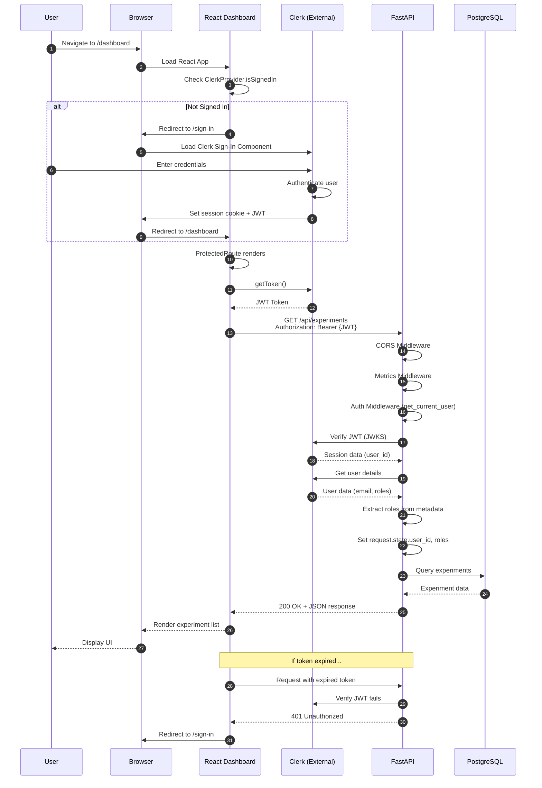

# Runtime Scenario: User Authentication Flow

## Purpose
This diagram answers: **How does a user authenticate and access protected resources?**

## Scope
- **Includes**: Sign-in, JWT verification, role extraction, protected route access
- **Excludes**: User registration (handled entirely by Clerk)

## Source of Truth References
| Step | Evidence Path |
|------|---------------|
| Clerk Provider | `src/dashboard/src/App.tsx:97-100` |
| ProtectedRoute | `src/dashboard/src/components/ProtectedRoute.tsx` |
| API Token Injection | `src/dashboard/src/services/api.ts:27-38`, `src/dashboard/src/hooks/useClerkApi.ts` |
| Auth Middleware | `src/api/src/middleware/auth.py:15-72` |
| Clerk Service | `src/api/src/services/clerk_service.py` |

## Sequence Diagram

## Flow Description

### 1. Initial Page Load
1. User navigates to a protected route (e.g., `/dashboard`)
2. React app loads with ClerkProvider wrapping all components
3. ProtectedRoute checks authentication status via `useAuth()` hook

### 2. Sign-In (if not authenticated)
1. User is redirected to `/sign-in` page
2. Clerk's hosted sign-in component handles authentication
3. Credentials are verified by Clerk
4. Session is established with JWT token

### 3. API Request with Authentication
1. Dashboard calls `api.getExperiments()`
2. API client's request interceptor calls Clerk's `getToken()`
3. JWT is added to Authorization header
4. FastAPI receives request through middleware chain:
   - **CORS** → validates origin
   - **Metrics** → records request metrics
   - **Auth** → extracts and verifies JWT

### 4. JWT Verification
1. `get_current_user` dependency extracts Bearer token
2. `clerk_service.verify_token(token)` validates JWT:
   - Fetches JWKS from Clerk
   - Verifies signature and expiration
   - Extracts session claims
3. User details fetched from Clerk API
4. Roles extracted from user metadata

### 5. Authorization
1. User ID and roles stored in `request.state`
2. Route handler can access via dependency injection
3. Role-based access control via `require_roles()` decorator

## Error Scenarios

| Scenario | Response | Client Action |
|----------|----------|---------------|
| No token provided | 401 Unauthorized | Redirect to /sign-in |
| Invalid/expired token | 401 Unauthorized | Redirect to /sign-in |
| Clerk service down | 503 Service Unavailable | Show error message |
| Insufficient roles | 403 Forbidden | Show unauthorized page |

## Assumptions
- **None** - All authentication flows verified in codebase
