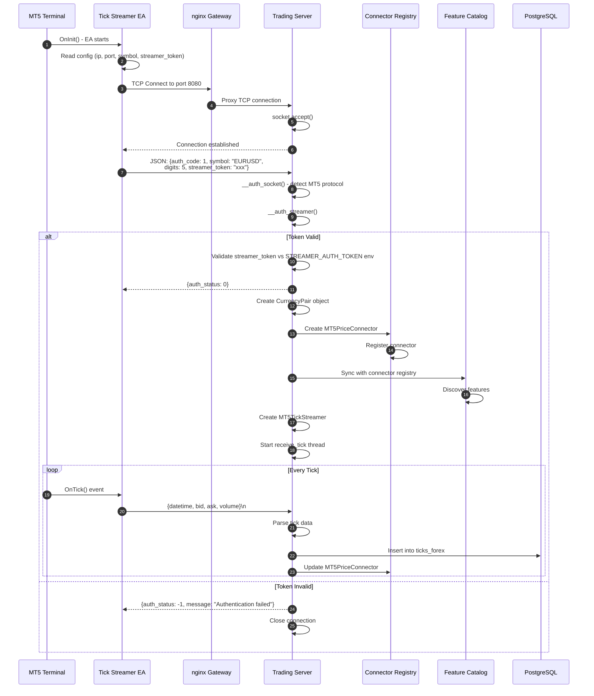
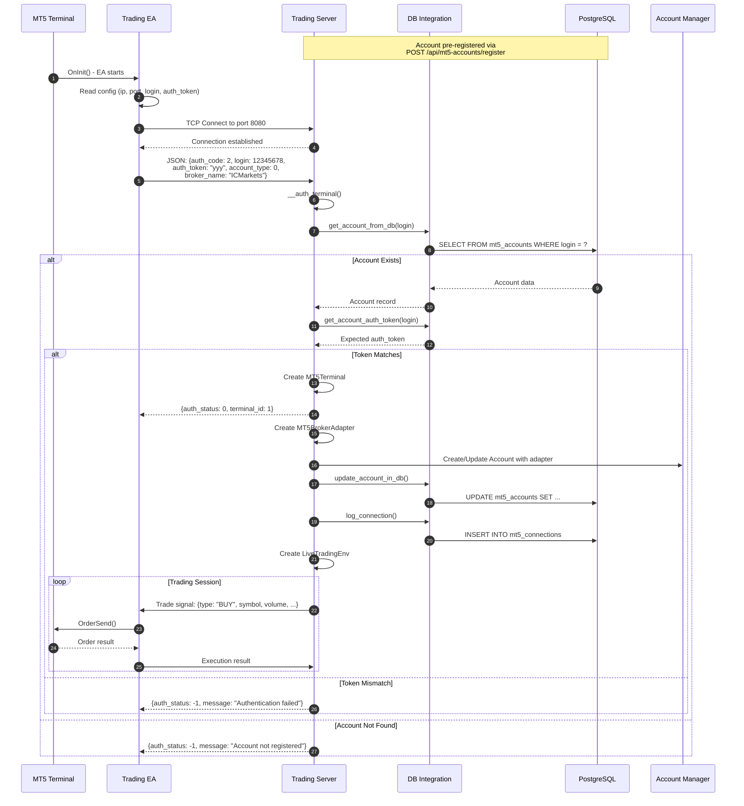

# Runtime Scenario: MT5 Expert Advisor Connection Flow

## Purpose
This diagram answers: **How do MT5 Expert Advisors connect to the Trading Server for tick streaming and trade execution?**

## Scope
- **Includes**: Streamer authentication, Terminal authentication, connection lifecycle
- **Excludes**: Internal MT5 operations

## Source of Truth References
| Step | Evidence Path |
|------|---------------|
| Socket Server | `src/trading_server/src/server.py:169-188` |
| Auth Socket | `src/trading_server/src/server.py:212-355` |
| Streamer Auth | `src/trading_server/src/server.py:357-465` |
| Terminal Auth | `src/trading_server/src/server.py:467-567` |
| Tick Streamer EA | `src/utils/MT5-EA/EAs/mt5_tick_streamer.mq5` |
| Trading EA | `src/utils/MT5-EA/EAs/mt5_trading_operation.mq5` |

## Sequence Diagram - Tick Streamer Connection



## Sequence Diagram - Trading Terminal Connection



## Authentication Protocol

### Streamer Authentication
| Field | Type | Description |
|-------|------|-------------|
| `auth_code` | int | Must be `1` for streamer |
| `symbol` | string | Currency pair (e.g., "EURUSD") |
| `digits` | int | Decimal precision (e.g., 5) |
| `streamer_token` | string | Must match `STREAMER_AUTH_TOKEN` env var |

### Terminal Authentication
| Field | Type | Description |
|-------|------|-------------|
| `auth_code` | int | Must be `2` for terminal |
| `login` | int | MT5 account login number |
| `auth_token` | string | Per-account token from registration |
| `account_type` | int | 0=Demo, 2=Live |
| `broker_name` | string | Optional broker identifier |

### Response Format
```json
// Success
{"auth_status": 0, "terminal_id": 1}

// Failure
{"auth_status": -1, "message": "Error description"}
```

## Connection Lifecycle

### Streamer Lifecycle
1. EA connects on chart attach
2. Server authenticates with environment token
3. Streamer thread receives ticks continuously
4. On EA removal/MT5 close: socket closes, connection cleaned up

### Terminal Lifecycle
1. Account pre-registered via API (user gets auth_token)
2. EA connects with account credentials
3. Server validates token from database
4. Terminal ready to receive trade commands
5. Connection status tracked in `mt5_connections` table

## Error Scenarios

| Scenario | Response | Recovery |
|----------|----------|----------|
| Invalid streamer token | `auth_status: -1` | Check `STREAMER_AUTH_TOKEN` env var |
| Account not registered | `auth_status: -1` | Register via API first |
| Invalid auth token | `auth_status: -1` | Verify token from registration |
| Connection timeout | Socket closed | EA auto-reconnects |
| Server unavailable | Connection refused | Check server status |

## Assumptions
- **None** - All connection flows verified in codebase
