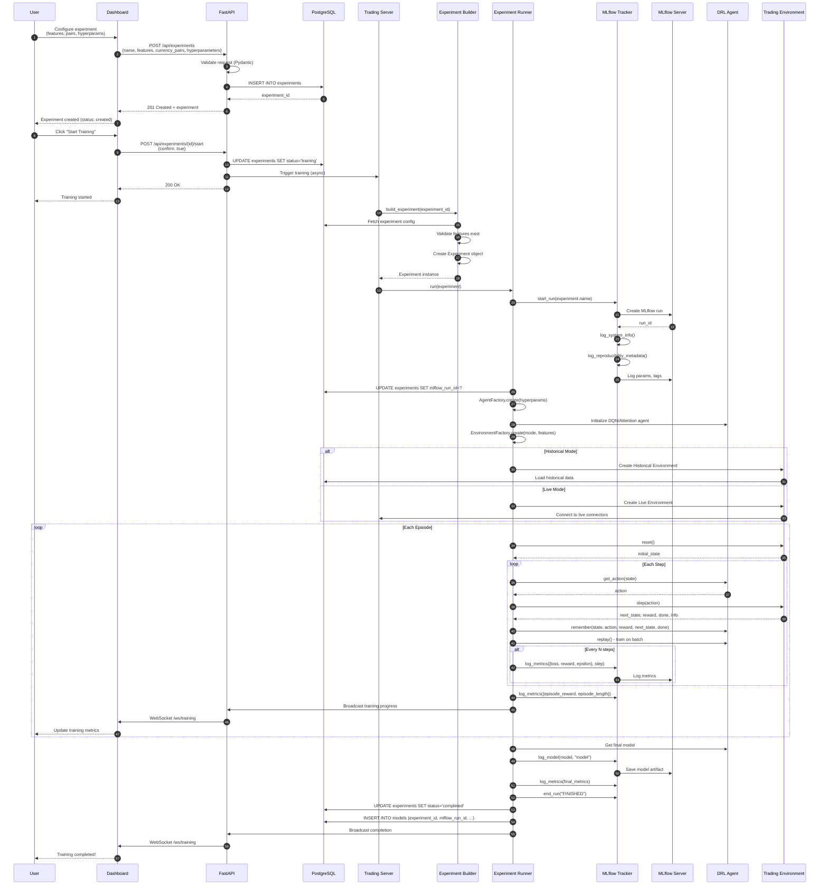

# Runtime Scenario: Experiment Training Flow

## Purpose
This diagram answers: **How does the platform execute an experiment training run from creation to completion?**

## Scope
- **Includes**: Experiment creation, training execution, MLflow logging, model registration
- **Excludes**: Optuna hyperparameter search (separate diagram)

## Source of Truth References
| Step | Evidence Path |
|------|---------------|
| Experiment API | `src/api/src/routers/experiments.py` |
| Experiment Service | `src/api/src/services/experiment_service.py` |
| Experiment Builder | `src/trading_server/src/experiments/builder.py` |
| Experiment Runner | `src/trading_server/src/experiments/runner.py` |
| Experiment Tracker | `src/trading_server/src/mlops/experiment_tracker.py` |
| Agent Factory | `src/trading_server/src/infrastructure/factories/agent_factory.py` |
| Environment Factory | `src/trading_server/src/infrastructure/factories/environment_factory.py` |

## Sequence Diagram

## Flow Description

### 1. Experiment Creation
1. User configures experiment in ExperimentBuilder page:
   - Selects features from catalog
   - Chooses currency pairs
   - Sets hyperparameters (learning_rate, gamma, etc.)
   - Chooses training mode (live/historical)
2. API validates and persists to database
3. Experiment created with status `created`

### 2. Training Initiation
1. User clicks "Start Training" with confirmation
2. API updates status to `training`
3. Trading Server receives async trigger

### 3. MLflow Run Setup
1. ExperimentTracker creates new MLflow run
2. Logs reproducibility metadata:
   - Git commit hash
   - Python version
   - Config hash
   - Environment ID
3. Experiment linked via `mlflow_run_id`

### 4. Agent & Environment Setup
1. AgentFactory creates appropriate agent (DQN, Attention DQN)
2. EnvironmentFactory creates environment based on mode:
   - **Historical**: Loads data from database, replays
   - **Live**: Connects to real-time connectors

### 5. Training Loop
1. Standard RL loop: reset → step → remember → replay
2. Periodic metric logging to MLflow
3. WebSocket broadcasts for real-time dashboard updates

### 6. Completion & Model Registration
1. Final model saved as MLflow artifact
2. Experiment status updated to `completed`
3. Model registered in `models` table

## Training Modes

| Mode | Data Source | Use Case |
|------|-------------|----------|
| **Historical** | Database (ticks_forex) | Backtesting, initial training |
| **Live** | Real-time connectors | Online learning, paper trading |

## Logged Metrics

| Metric | Description |
|--------|-------------|
| `loss` | Training loss per step |
| `reward` | Step reward |
| `epsilon` | Exploration rate |
| `episode_reward` | Total episode reward |
| `episode_length` | Steps per episode |
| `sharpe_ratio` | Risk-adjusted returns |
| `win_rate` | Percentage of winning trades |
| `max_drawdown` | Maximum drawdown |

## Assumptions
- **None** - All training flows verified in codebase
