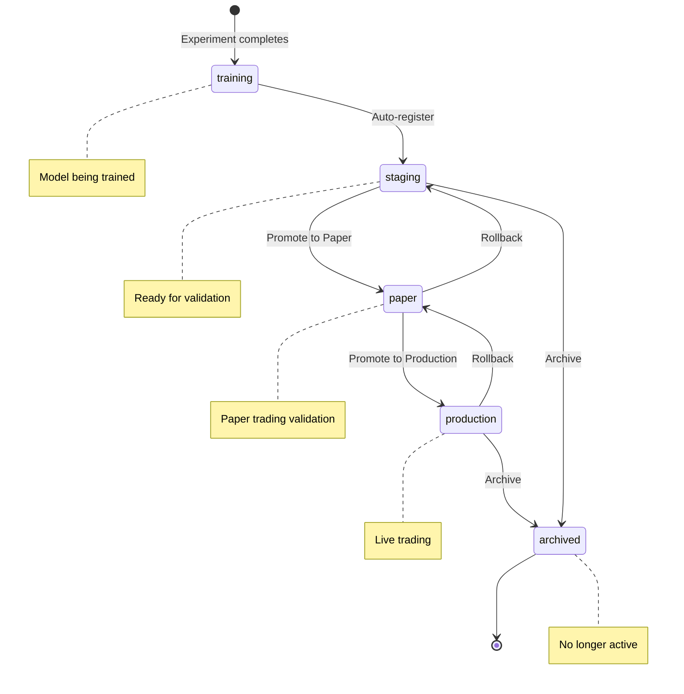
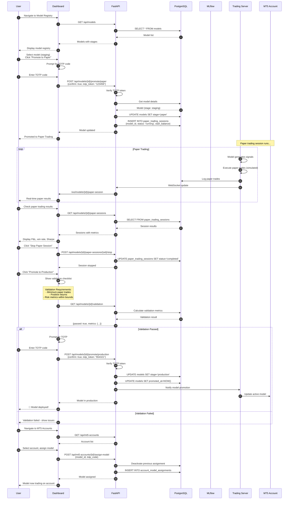

# Runtime Scenario: Model Promotion Flow

## Purpose
This diagram answers: **How does a model progress through the lifecycle stages from training to production?**

## Scope
- **Includes**: Model stages, promotion workflow, paper trading validation, production deployment
- **Excludes**: Training details (separate diagram)

## Source of Truth References
| Step | Evidence Path |
|------|---------------|
| Model API | `src/api/src/routers/models.py` |
| Model Service | `src/api/src/services/model_service.py` |
| Model Schema | `src/database/scripts/10_models.sql` |
| Paper Session Schema | `src/database/scripts/10_models.sql:27-44` |
| Dashboard Pages | `src/dashboard/src/pages/ModelRegistry.tsx` |

## Model Lifecycle Stages

## Promotion Sequence Diagram

## Stage Transitions

| From | To | Requirements | API Endpoint |
|------|----|--------------|--------------|
| staging | paper | TOTP verification | `POST /models/{id}/promote/paper` |
| paper | production | TOTP + validation passed | `POST /models/{id}/promote/production` |
| production | paper | TOTP verification | `POST /models/{id}/rollback` |
| paper | staging | TOTP verification | `POST /models/{id}/rollback` |
| any | archived | TOTP verification | `POST /models/{id}/archive` |

## Validation Requirements (Production Promotion)

| Metric | Requirement |
|--------|-------------|
| Paper trades | Minimum number executed |
| Total P&L | Must be positive |
| Win rate | Above threshold |
| Max drawdown | Below threshold |
| Sharpe ratio | Above threshold |

## Paper Trading Session

| Field | Description |
|-------|-------------|
| `model_id` | Associated model |
| `status` | running/completed/stopped |
| `start_balance` | Initial simulated balance |
| `current_balance` | Current balance |
| `total_trades` | Number of trades |
| `winning_trades` | Profitable trades |
| `pnl` | Profit/Loss |
| `sharpe_ratio` | Risk-adjusted return |
| `max_drawdown` | Maximum drawdown |

## WebSocket Channels

| Channel | Purpose |
|---------|---------|
| `/ws/models` | All model lifecycle updates |
| `/ws/models/{id}/status` | Specific model status changes |
| `/ws/models/{id}/paper-session` | Paper trading updates |
| `/ws/models/{id}/validation` | Validation status |

## Security Controls

1. **TOTP Required**: All promotion/rollback actions require 2FA
2. **Confirmation**: Explicit `confirm: true` flag required
3. **Audit Trail**: `promoted_at` and `promoted_by` tracked
4. **Ownership**: Only account owners can assign models

## Assumptions
- **None** - All promotion flows verified in codebase
