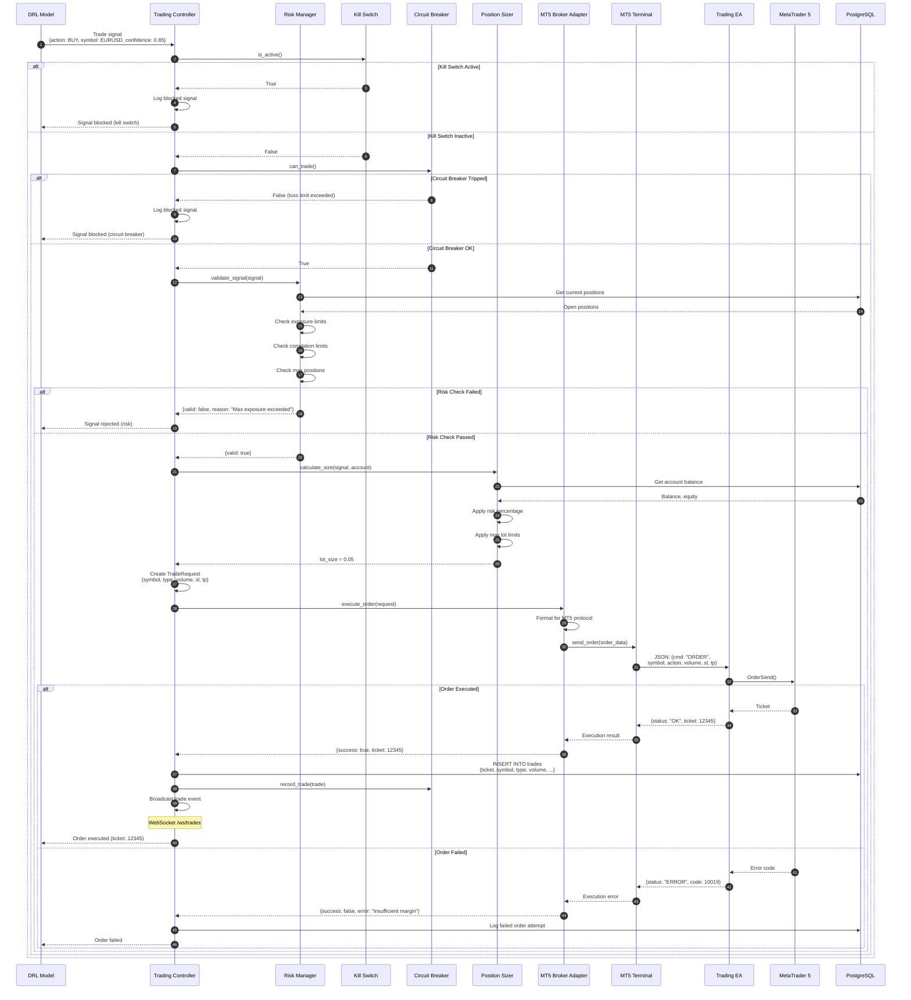
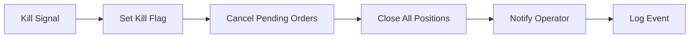

# Runtime Scenario: Trade Execution Flow

## Purpose
This diagram answers: **How does a trade signal from a trained model result in an executed order on MT5?**

## Scope
- **Includes**: Signal generation, risk validation, order execution, result handling
- **Excludes**: Model training, account registration

## Source of Truth References
| Step | Evidence Path |
|------|---------------|
| Trading Controller | `src/trading_server/src/trading_controller.py` |
| Risk Manager | `src/trading_server/src/risk/risk_manager.py` |
| Kill Switch | `src/trading_server/src/risk/kill_switch.py` |
| Circuit Breaker | `src/trading_server/src/risk/circuit_breaker.py` |
| Position Sizer | `src/trading_server/src/risk/position_sizer.py` |
| Broker Adapter | `src/trading_server/src/trading/brokers/mt5_adapter.py` |
| MT5 Terminal | `src/trading_server/src/mt5_connection/terminal.py` |
| Trading EA | `src/utils/MT5-EA/EAs/mt5_trading_operation.mq5` |

## Sequence Diagram



## Risk Management Checks

### Kill Switch
| Check | Trigger | Effect |
|-------|---------|--------|
| File-based | `/app/logs/kill_switch.flag` exists | All trading halted |
| Environment | `KILL_SWITCH_ACTIVE=true` | All trading halted |
| API trigger | `POST /api/trading/kill` | Creates flag file |
| Signal | SIGTERM/SIGINT | Graceful shutdown |

### Circuit Breaker
| Check | Configuration | Action |
|-------|---------------|--------|
| Daily loss limit | e.g., -5% | Halt trading for day |
| Weekly loss limit | e.g., -10% | Halt trading for week |
| Consecutive losses | e.g., 5 in a row | Halt and alert |
| Drawdown limit | e.g., -15% from peak | Halt trading |

### Risk Manager
| Validation | Description |
|------------|-------------|
| Max exposure | Total position size limit |
| Max positions | Maximum concurrent trades |
| Correlation | Limit correlated positions |
| Symbol exposure | Per-symbol limits |

### Position Sizing
| Method | Description |
|--------|-------------|
| Fixed percentage | Risk % of balance per trade |
| ATR-based | Size based on volatility |
| Max lot cap | Upper limit on lot size |
| Min lot floor | Minimum tradeable size |

## Order Flow Details

### TradeRequest Structure
```python
@dataclass
class TradeRequest:
    symbol: str          # "EURUSD"
    action: ActionType   # BUY, SELL
    volume: float        # Lot size
    price: float         # Entry price (0 for market)
    sl: float           # Stop loss
    tp: float           # Take profit
    magic: int          # EA magic number
    comment: str        # Trade comment
```

### MT5 EA Protocol
```json
// Order command
{
  "cmd": "ORDER",
  "symbol": "EURUSD",
  "action": 0,       // 0=BUY, 1=SELL
  "volume": 0.05,
  "sl": 1.0800,
  "tp": 1.0900,
  "magic": 123456,
  "comment": "model_v1.2.3"
}

// Response
{
  "status": "OK",
  "ticket": 12345678,
  "open_price": 1.0850,
  "open_time": 1704067200
}
```

## Safety Infrastructure

### Multi-Layer Protection
1. **Kill Switch** (Immediate halt - manual or automated)
2. **Circuit Breaker** (Automatic halt on loss thresholds)
3. **Risk Manager** (Pre-trade validation)
4. **Position Sizer** (Appropriate sizing)

### Emergency Stop Sequence


## Trade Logging

| Table | Purpose |
|-------|---------|
| `trades` | All executed trades |
| `orders` | Order attempts (success/fail) |
| `kill_switch_events` | Kill switch activations |
| `circuit_breaker_events` | Circuit breaker trips |

## Error Codes

| MT5 Error | Description | Handling |
|-----------|-------------|----------|
| 10004 | Requote | Retry with new price |
| 10006 | Request rejected | Log and notify |
| 10014 | Invalid volume | Adjust to limits |
| 10019 | Not enough money | Reduce size or skip |
| 10025 | Server busy | Retry with backoff |

## Assumptions
- **None** - All execution flows verified in codebase
