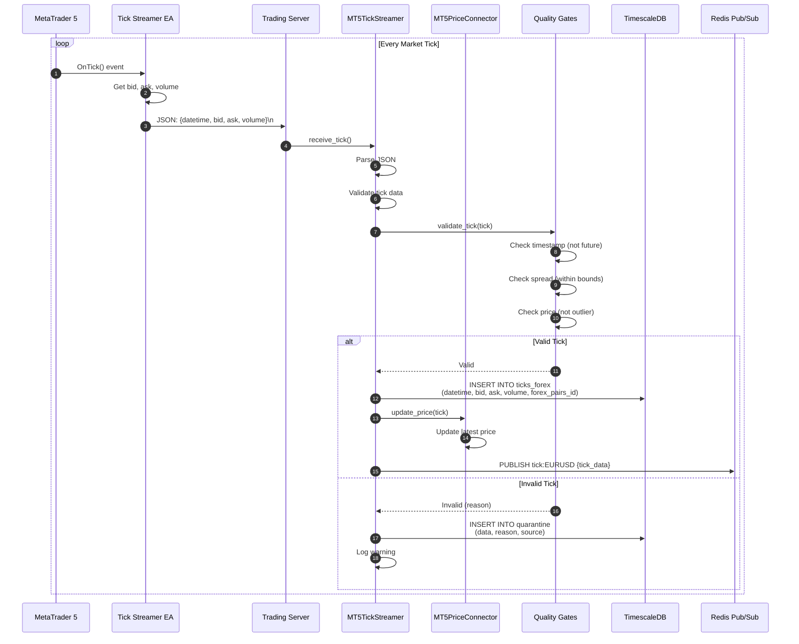
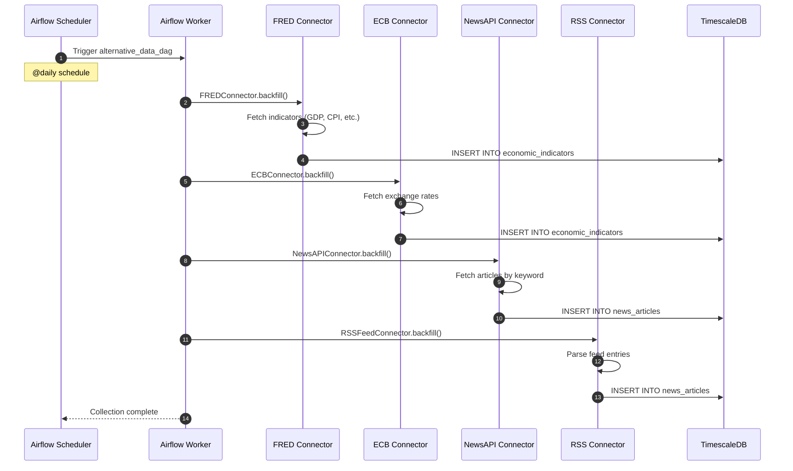

# Runtime Scenario: Data Ingestion Flow

## Purpose
This diagram answers: **How does market data and alternative data flow from sources into the platform's storage?**

## Scope
- **Includes**: Real-time tick ingestion, scheduled data collection, quality gates
- **Excludes**: Feature computation (separate dataflow diagram)

## Source of Truth References
| Step | Evidence Path |
|------|---------------|
| Tick Streamer | `src/trading_server/src/mt5_connection/tick_streamer.py` |
| Data Connectors | `src/trading_server/src/connectors/*.py` |
| Connector Interface | `src/trading_server/src/connectors/base.py` |
| Quality Gates | `src/trading_server/src/data/quality_gates.py` |
| Data Contracts | `src/trading_server/src/data/contracts/*.py` |
| Airflow DAGs | `src/trading_server/src/infrastructure/data_pipeline/airflow/dags/*.py` |
| Celery Tasks | `src/trading_server/src/infrastructure/data_pipeline/tasks/*.py` |

## Real-Time Tick Ingestion



## Scheduled Data Collection (Airflow)

**Note**: MT5 tick data collection is no longer scheduled via Airflow. Real-time tick collection is handled exclusively through ZeroMQ streaming (see "Real-Time Tick Ingestion" section above). The scheduled `data_collection_pipeline` DAG has been removed.

Historical backfill and gap filling for MT5 data can still be performed manually using the `historical_backfill_dag` DAG, which uses the `collect_mt5_data` Celery task on-demand.

## Alternative Data Collection



## Connector Interface

All connectors implement `IDataSourceConnector`:

```python
class IDataSourceConnector(ABC):
    @abstractmethod
    def stream(self, start_time) -> Iterator[Dict]:
        """Real-time streaming"""
        
    @abstractmethod
    def batch(self, start_time, end_time) -> Iterator[Dict]:
        """Historical data from DB"""
        
    @abstractmethod
    def backfill(self, start_time, end_time) -> Iterator[Dict]:
        """Historical data from source API"""
        
    @abstractmethod
    def get_schema(self) -> Dict:
        """Data schema definition"""
```

## Data Quality Gates

| Gate | Description | Action on Failure |
|------|-------------|-------------------|
| Timestamp validation | Not in future | Quarantine |
| Spread check | Within normal bounds | Quarantine |
| Price outlier | Not > N std from mean | Quarantine |
| Volume check | Non-negative | Quarantine |
| Duplicate check | No exact duplicates | Skip |

## Data Storage Schema

### ticks_forex (TimescaleDB Hypertable)
| Column | Type | Description |
|--------|------|-------------|
| id | BIGSERIAL | Unique identifier |
| datetime | TIMESTAMP | Tick timestamp (GMT+3) |
| bid | DOUBLE PRECISION | Bid price |
| ask | DOUBLE PRECISION | Ask price |
| volume | DOUBLE PRECISION | Tick volume |
| forex_pairs_id | INT | Foreign key to forex_pairs |

### economic_calendar
| Column | Type | Description |
|--------|------|-------------|
| datetime | TIMESTAMP | Event time |
| event | VARCHAR | Event name |
| impact | INT | 1-3 impact level |
| previous | VARCHAR | Previous value |
| consensus | VARCHAR | Expected value |
| actual | VARCHAR | Actual value |
| country_id | INT | Foreign key to country |

### quarantine (Invalid Data)
| Column | Type | Description |
|--------|------|-------------|
| data | JSONB | Raw invalid data |
| reason | VARCHAR | Rejection reason |
| source | VARCHAR | Data source |
| received_at | TIMESTAMP | When received |

## Airflow DAGs

| DAG | Schedule | Tasks |
|-----|----------|-------|
| `alternative_data_collection_dag` | @daily | FRED, ECB, NewsAPI, RSS |
| `historical_backfill_dag` | Manual | Historical data gaps, MT5 gap filling |

**Note**: The `data_collection_pipeline` DAG has been removed. MT5 tick collection is now exclusively handled via ZeroMQ real-time streaming. The `collect_mt5_data` Celery task remains available for manual gap filling and historical backfill operations.

## Assumptions
- **None** - All ingestion flows verified in codebase
