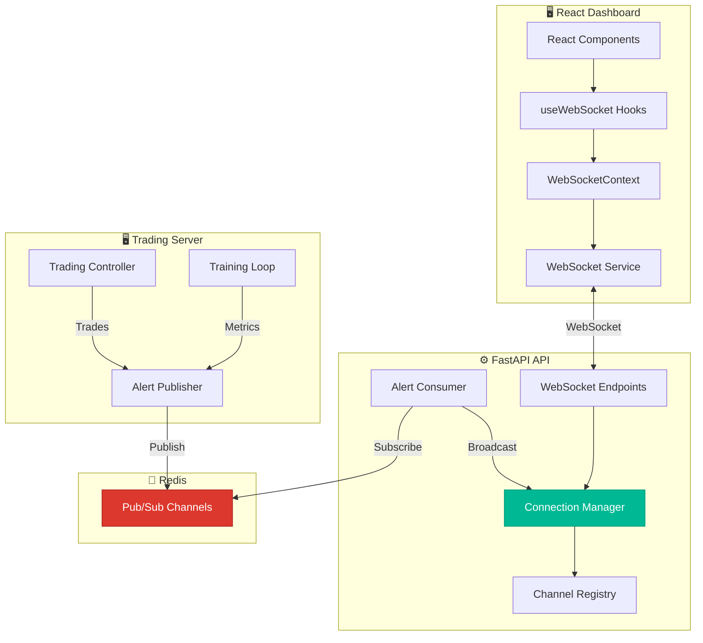
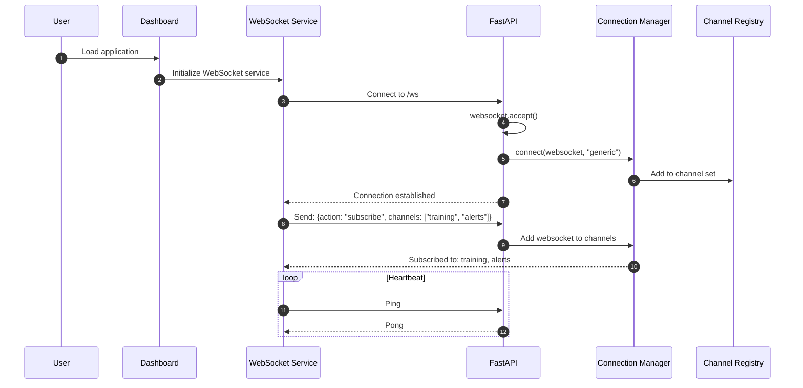
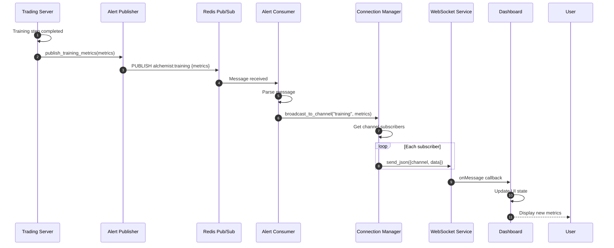

# Runtime Scenario: WebSocket Real-Time Updates

## Purpose
This diagram answers: **How do real-time updates flow from the backend services to the dashboard?**

## Scope
- **Includes**: WebSocket channels, subscription, broadcasting, alert consumption
- **Excludes**: REST API calls

## Source of Truth References
| Step | Evidence Path |
|------|---------------|
| WebSocket Manager | `src/api/src/websocket/manager.py` |
| Channel Handlers | `src/api/src/websocket/channels.py` |
| WebSocket Endpoints | `src/api/src/main.py:180-253` |
| Alert Consumer | `src/api/src/infrastructure/messaging/alert_consumer.py` |
| Alert Publisher | `src/trading_server/src/infrastructure/messaging/alert_publisher.py` |
| Dashboard WebSocket | `src/dashboard/src/services/websocket.ts` |
| WebSocket Context | `src/dashboard/src/contexts/WebSocketContext.tsx` |

## WebSocket Architecture



## Connection Sequence



## Broadcasting Sequence



## WebSocket Channels

| Channel | Path | Purpose | Publisher |
|---------|------|---------|-----------|
| `ticks` | `/ws/ticks` | Real-time tick data | Trading Server |
| `training` | `/ws/training` | Training progress | Experiment Runner |
| `optuna` | `/ws/optuna` | Hyperparameter search | Optuna Tuner |
| `positions` | `/ws/positions` | Open positions | Trading Controller |
| `alerts` | `/ws/alerts` | System alerts | Various |
| `mt5_accounts` | `/ws/accounts/mt5` | Connection status | Trading Server |
| `performance` | `/ws/performance` | Performance updates | Performance Service |
| `trades` | `/ws/trades` | Trade execution | Trading Controller |
| `models` | `/ws/models` | Model lifecycle | Model Service |
| `models/{id}/status` | `/ws/models/{id}/status` | Specific model status | Model Service |
| `models/{id}/paper-session` | `/ws/models/{id}/paper-session` | Paper trading | Paper Session |
| `models/{id}/validation` | `/ws/models/{id}/validation` | Validation status | Validation Service |

## Message Format

### Client → Server (Subscription)
```json
{
  "action": "subscribe",
  "channels": ["training", "alerts", "positions"]
}
```

### Server → Client (Broadcast)
```json
{
  "channel": "/ws/training/metrics",
  "data": {
    "experiment_id": 1,
    "episode": 42,
    "step": 1000,
    "reward": 0.05,
    "loss": 0.012,
    "epsilon": 0.3
  }
}
```

### Alert Message Types
```json
// Training progress
{
  "type": "training_progress",
  "experiment_id": 1,
  "metrics": {...}
}

// Trade executed
{
  "type": "trade_executed",
  "ticket": 12345,
  "symbol": "EURUSD",
  "action": "BUY",
  "volume": 0.05
}

// System alert
{
  "type": "alert",
  "severity": "warning",
  "message": "High drawdown detected"
}

// MT5 connection status
{
  "type": "connection_status",
  "account_id": 1,
  "connected": true
}
```

## Dashboard WebSocket Hooks

| Hook | Channel | Usage |
|------|---------|-------|
| `useExperimentProgress` | training | Training monitor page |
| `useTradingPositions` | positions | Live trading page |
| `useOptunaTrials` | optuna | Hyperparameter search page |
| `useWebSocket` | generic | Base hook for any channel |

## Connection Management

### Reconnection Strategy
```typescript
// From websocket.ts
const RECONNECT_DELAYS = [1000, 2000, 5000, 10000, 30000]
```

1. Immediate reconnect attempt
2. Exponential backoff with jitter
3. Max 5 retry attempts before alert

### Heartbeat
- Ping every 30 seconds
- Disconnect if no pong within 10 seconds
- Auto-reconnect on disconnect

## Redis Pub/Sub Channels

| Redis Channel | API Channel | Purpose |
|---------------|-------------|---------|
| `alchemist:training` | training | Training metrics |
| `alchemist:alerts` | alerts | System alerts |
| `alchemist:trades` | trades | Trade events |
| `alchemist:positions` | positions | Position updates |
| `alchemist:mt5` | mt5_accounts | MT5 status |

## Error Handling

| Scenario | Action |
|----------|--------|
| Connection failed | Retry with backoff |
| Message parse error | Log and continue |
| Channel not found | Ignore subscription |
| Client disconnect | Clean up subscriptions |
| Redis down | API continues, no broadcasts |

## Assumptions
- **None** - All WebSocket flows verified in codebase
