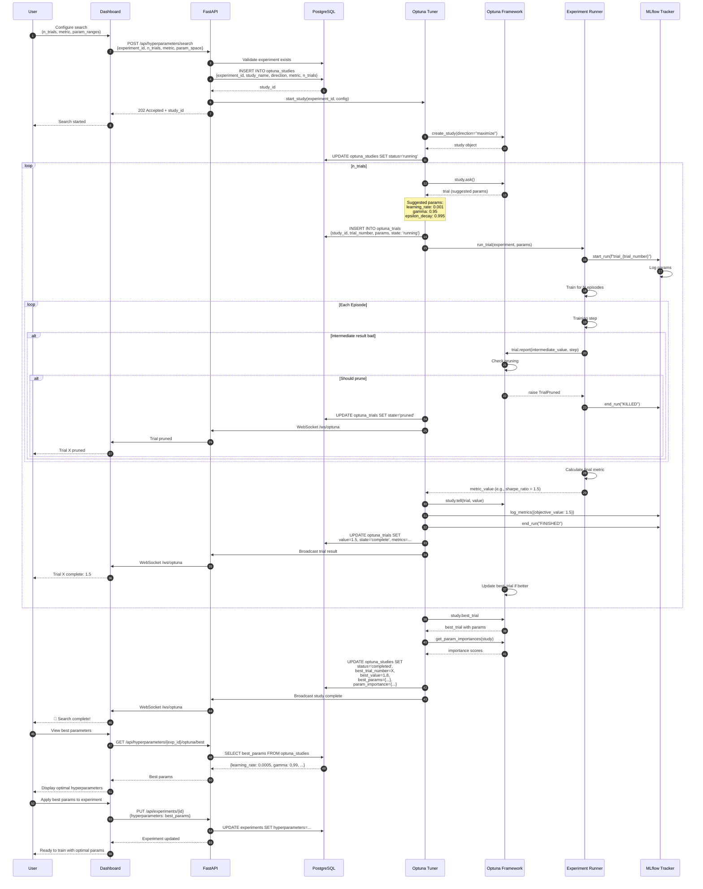

# Runtime Scenario: Optuna Hyperparameter Search

## Purpose
This diagram answers: **How does the platform perform automated hyperparameter optimization using Optuna?**

## Scope
- **Includes**: Study creation, trial execution, pruning, best params selection
- **Excludes**: Individual training details

## Source of Truth References
| Step | Evidence Path |
|------|---------------|
| Optuna Tuner | `src/trading_server/src/experiments/optuna_tuner.py` |
| Hyperparameters API | `src/api/src/routers/hyperparameters.py` |
| Optuna Schema | `src/database/scripts/08_experiments.sql:55-93` |
| Dashboard Page | `src/dashboard/src/pages/HyperparameterSearch.tsx` |
| API Client | `src/dashboard/src/services/api.ts:116-143` |

## Sequence Diagram



## Optuna Configuration

### Search Space Definition
```python
param_space = {
    "learning_rate": {
        "type": "loguniform",
        "low": 1e-5,
        "high": 1e-2
    },
    "gamma": {
        "type": "uniform",
        "low": 0.9,
        "high": 0.999
    },
    "epsilon_decay": {
        "type": "uniform",
        "low": 0.99,
        "high": 0.9999
    },
    "batch_size": {
        "type": "categorical",
        "choices": [32, 64, 128, 256]
    },
    "hidden_size": {
        "type": "int",
        "low": 64,
        "high": 512,
        "step": 64
    }
}
```

### Study Configuration
| Parameter | Description | Default |
|-----------|-------------|---------|
| `n_trials` | Number of trials to run | 50 |
| `direction` | Optimization direction | "maximize" |
| `metric` | Target metric | "sharpe_ratio" |
| `sampler` | TPE, Random, Grid | TPESampler |
| `pruner` | MedianPruner, NopPruner | MedianPruner |

## Database Schema

### optuna_studies
| Column | Type | Description |
|--------|------|-------------|
| id | SERIAL | Study ID |
| experiment_id | INT | Parent experiment |
| study_name | VARCHAR | Unique study name |
| direction | ENUM | maximize/minimize |
| metric | VARCHAR | Target metric |
| n_trials | INT | Total trials |
| status | ENUM | running/completed/failed/stopped |
| best_trial_number | INT | Best trial index |
| best_value | DECIMAL | Best objective value |
| best_params | JSONB | Best hyperparameters |
| param_importance | JSONB | Feature importance |

### optuna_trials
| Column | Type | Description |
|--------|------|-------------|
| id | SERIAL | Trial ID |
| study_id | INT | Parent study |
| trial_number | INT | Trial index |
| params | JSONB | Hyperparameters used |
| value | DECIMAL | Objective value |
| state | ENUM | running/complete/pruned/fail |
| metrics | JSONB | All metrics |
| mlflow_run_id | VARCHAR | Linked MLflow run |

## Pruning Strategy

### MedianPruner
- Prunes trial if intermediate value worse than median of previous trials
- Warm-up period: 5 trials before pruning starts
- Check interval: every 10 episodes

```python
# Pruning check in training loop
for episode in range(max_episodes):
    reward = train_episode()
    trial.report(reward, episode)
    
    if trial.should_prune():
        raise optuna.TrialPruned()
```

## Metrics Tracked

| Metric | Description | Optimization |
|--------|-------------|--------------|
| `sharpe_ratio` | Risk-adjusted returns | Maximize |
| `win_rate` | Percentage winning trades | Maximize |
| `total_pnl` | Total profit/loss | Maximize |
| `max_drawdown` | Maximum drawdown | Minimize |
| `sortino_ratio` | Downside risk-adjusted | Maximize |

## Parameter Importance

After study completion, Optuna calculates parameter importance using:
- **fANOVA** (functional ANOVA)
- Measures how much each parameter contributes to variance

```json
{
  "learning_rate": 0.45,
  "gamma": 0.28,
  "batch_size": 0.15,
  "hidden_size": 0.08,
  "epsilon_decay": 0.04
}
```

## API Endpoints

| Endpoint | Method | Description |
|----------|--------|-------------|
| `/api/hyperparameters/search` | POST | Start new search |
| `/api/hyperparameters/{exp_id}/optuna/status` | GET | Get study status |
| `/api/hyperparameters/{exp_id}/optuna/trials` | GET | List all trials |
| `/api/hyperparameters/{exp_id}/optuna/best` | GET | Get best params |
| `/api/hyperparameters/{exp_id}/optuna/stop` | POST | Stop running study |

## Assumptions
- **None** - All Optuna flows verified in codebase
