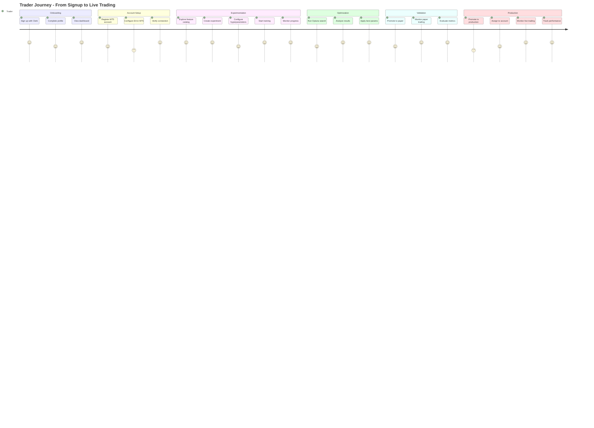

# User Journey: Trader/Researcher

## Purpose
This diagram answers: **What is the complete journey of a trader using the platform from first login to live trading?**

## Scope
- **Includes**: All key touchpoints from onboarding to production trading
- **Excludes**: Admin-specific flows

## Persona

| Attribute | Description |
|-----------|-------------|
| **Role** | Trader / Quantitative Researcher |
| **Goal** | Develop and deploy profitable DRL trading models |
| **Technical Level** | Moderate to high (understands ML concepts) |
| **Primary Device** | Desktop browser |

## User Journey Diagram



## Detailed User Flow

```mermaid
flowchart TB
    subgraph Onboarding["🚀 Onboarding"]
        Start([Start]) --> SignIn["Sign In/Sign Up<br/>/sign-in"]
        SignIn -->|"New User"| Clerk["Clerk Auth<br/>Create Account"]
        SignIn -->|"Existing"| ClerkAuth["Clerk Auth<br/>Verify Credentials"]
        Clerk --> Dashboard
        ClerkAuth --> Dashboard
        Dashboard["Dashboard<br/>/dashboard"]
    end

    subgraph AccountSetup["🔧 Account Setup"]
        Dashboard --> Accounts["MT5 Accounts<br/>/accounts"]
        Accounts --> Register["Register Account<br/>Enter login + type"]
        Register --> GetToken["Receive Auth Token<br/>(One-time display)"]
        GetToken --> ConfigEA["Configure MT5 EA<br/>Set ip, port, auth_token"]
        ConfigEA --> AttachEA["Attach EA to Chart"]
        AttachEA --> Connected["✅ Connected<br/>Status: Online"]
    end

    subgraph Experimentation["🧪 Experimentation"]
        Connected --> Features["Feature Catalog<br/>/features"]
        Features --> SelectFeatures["Select Features<br/>RSI, MACD, etc."]
        SelectFeatures --> Builder["Experiment Builder<br/>/experiments"]
        Builder --> Configure["Configure Experiment<br/>Name, pairs, mode"]
        Configure --> Hyperparams["Set Hyperparameters<br/>LR, gamma, etc."]
        Hyperparams --> Create["Create Experiment"]
        Create --> StartTrain["Start Training"]
        StartTrain --> Monitor["Training Monitor<br/>/training"]
    end

    subgraph Optimization["⚡ Optimization"]
        Monitor -->|"Explore Hyperparams"| Optuna["Optuna Search<br/>/hyperparameters"]
        Optuna --> ConfigSearch["Configure Search<br/>n_trials, metric, ranges"]
        ConfigSearch --> RunSearch["Run Search"]
        RunSearch --> ViewTrials["View Trials<br/>Best params"]
        ViewTrials --> ApplyBest["Apply Best Params"]
        ApplyBest --> Retrain["Retrain with Optimal"]
        Retrain --> Monitor
    end

    subgraph Validation["✅ Validation"]
        Monitor -->|"Training Complete"| Registry["Model Registry<br/>/models"]
        Registry --> ViewModel["View Model Details"]
        ViewModel --> PromotePaper["Promote to Paper<br/>TOTP Required"]
        PromotePaper --> PaperSession["Paper Trading Session"]
        PaperSession --> MonitorPaper["Monitor Paper Results<br/>P&L, Win Rate, Sharpe"]
        MonitorPaper -->|"Validation Passed"| PromoteProd["Promote to Production<br/>TOTP Required"]
        MonitorPaper -->|"Validation Failed"| Iterate["Iterate<br/>Back to Training"]
        Iterate --> Experimentation
    end

    subgraph Production["💹 Production"]
        PromoteProd --> AssignModel["Assign to MT5 Account<br/>TOTP Required"]
        AssignModel --> LiveTrading["Live Trading<br/>/trading"]
        LiveTrading --> MonitorLive["Monitor Live<br/>Positions, P&L"]
        MonitorLive --> Performance["Performance Dashboard<br/>/performance"]
        Performance -->|"Emergency"| KillSwitch["Kill Switch<br/>TOTP Required"]
        KillSwitch --> Stopped["Trading Halted"]
    end

    style Dashboard fill:#3498db,stroke:#2980b9,color:#fff
    style Connected fill:#27ae60,stroke:#229954,color:#fff
    style PromoteProd fill:#9b59b6,stroke:#8e44ad,color:#fff
    style KillSwitch fill:#e74c3c,stroke:#c0392b,color:#fff
```



## Screen Reference

| Screen | Route | Purpose | Key Actions |
|--------|-------|---------|-------------|
| Dashboard | `/dashboard` | Overview | View stats, recent activity |
| MT5 Accounts | `/accounts` | Account management | Register, view status |
| Feature Catalog | `/features` | Browse features | Search, filter, details |
| Experiment Builder | `/experiments` | Create experiments | Configure, create |
| Training Monitor | `/training` | Monitor training | View metrics, progress |
| Hyperparameter Search | `/hyperparameters` | Optuna UI | Configure, run, analyze |
| Model Registry | `/models` | Model lifecycle | View, promote, rollback |
| Live Trading | `/trading` | Trading control | Monitor, kill switch |
| Performance | `/performance` | Analytics | Metrics, charts, history |
| Model Performance | `/performance/:modelId` | Model-specific | Detailed model analytics |

## Key Decision Points

### 1. Training Mode Selection
```
Historical Mode: Backtest on historical data
├── Pro: Fast iteration
├── Pro: Reproducible
└── Con: No live market dynamics

Live Mode: Train on real-time data
├── Pro: Realistic market conditions
├── Pro: Online learning
└── Con: Slower, requires MT5 connection
```

### 2. Hyperparameter Strategy
```
Manual: Set params yourself
├── Pro: Full control
├── Pro: Fast for known good params
└── Con: May miss optimal

Optuna Search: Automated optimization
├── Pro: Finds optimal params
├── Pro: Parameter importance analysis
└── Con: Time-consuming (many trials)
```

### 3. Validation Criteria
```
Paper Trading Validation:
├── Minimum trades: 50+
├── Positive P&L: Required
├── Win rate: > 50%
├── Max drawdown: < 15%
└── Sharpe ratio: > 1.0
```

## Error States

| State | Trigger | Recovery |
|-------|---------|----------|
| MT5 Disconnected | EA stops, network issue | Reconnect EA |
| Training Failed | Exception in training | Check logs, retry |
| Validation Failed | Metrics below threshold | Iterate, retrain |
| Kill Switch Active | Manual trigger or auto | Reset after review |

## Success Criteria

| Stage | Success Metric |
|-------|----------------|
| Onboarding | Account created, MT5 connected |
| Experimentation | Training completes, model saved |
| Optimization | Improvement over baseline |
| Validation | Paper trading profitable |
| Production | Live trading with acceptable risk |

## Assumptions
- **None** - All user flows verified against dashboard routes and API
