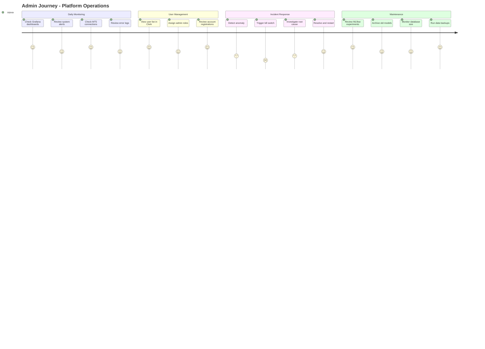
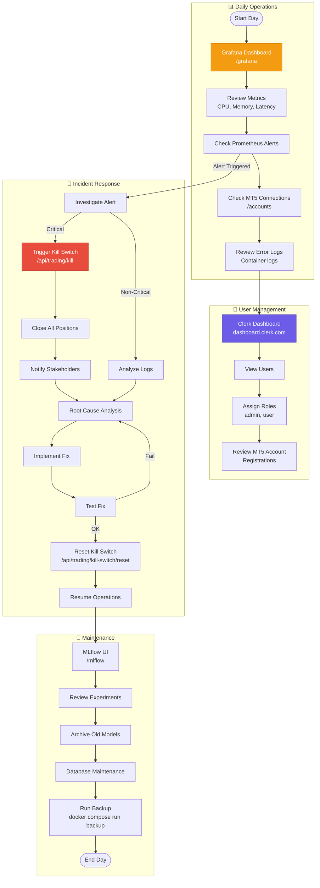
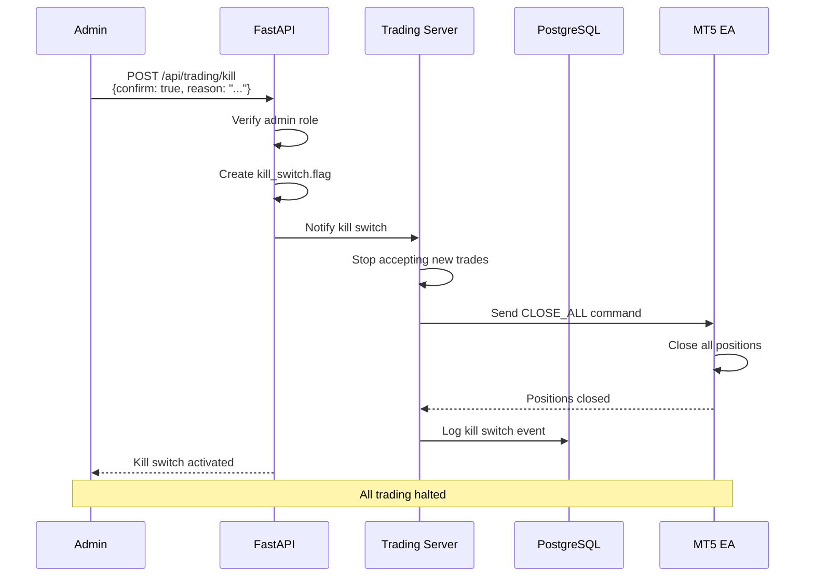

# User Journey: Platform Administrator

## Purpose
This diagram answers: **What is the administrative workflow for managing the platform, monitoring health, and handling emergencies?**

## Scope
- **Includes**: System monitoring, user management, emergency procedures
- **Excludes**: Standard trading workflows (covered in trader journey)

## Persona

| Attribute | Description |
|-----------|-------------|
| **Role** | Platform Administrator / DevOps |
| **Goal** | Ensure platform stability, manage users, handle incidents |
| **Technical Level** | High (understands infrastructure) |
| **Access Level** | Admin role in Clerk, Grafana access |

## Admin Journey Diagram



## Admin Flow Diagram



## Admin Tools & Access

| Tool | URL | Purpose | Access |
|------|-----|---------|--------|
| Grafana | `/grafana` | Metrics dashboards | Admin credentials |
| Prometheus | `:9090` (internal) | Raw metrics, alerts | Port forward |
| MLflow | `/mlflow` (if exposed) | Experiment tracking | No auth (internal) |
| Clerk Dashboard | `dashboard.clerk.com` | User management | Clerk admin |
| Container Logs | `docker logs <container>` | Debug logs | SSH access |
| Airflow | `:8081` | DAG management | Admin/admin |

## Grafana Dashboards

| Dashboard | Metrics | Alert Threshold |
|-----------|---------|-----------------|
| **API Health** | Request rate, latency, errors | Error rate > 1% |
| **Trading Server** | Connections, tick rate | Connection drops |
| **Database** | Query time, connections | Query time > 1s |
| **System** | CPU, Memory, Disk | CPU > 80% |
| **Trading** | Active positions, P&L | Drawdown > 10% |

## Emergency Procedures

### Kill Switch Activation



### Kill Switch Reset

1. **Verify issue resolved** - Root cause addressed
2. **Review open positions** - Confirm all closed
3. **Check system health** - All services healthy
4. **Reset via API** - `POST /api/trading/kill-switch/reset`
5. **Notify team** - Inform stakeholders
6. **Monitor closely** - Watch for recurrence

## Monitoring Alerts

### Prometheus Alert Rules

| Alert | Condition | Severity | Action |
|-------|-----------|----------|--------|
| `HighErrorRate` | error_rate > 0.01 for 5m | Warning | Investigate |
| `APIDown` | up{job="api"} == 0 | Critical | Restart service |
| `HighLatency` | latency_p99 > 5s | Warning | Check load |
| `DBConnectionFull` | connections > 90% | Critical | Scale or optimize |
| `HighDrawdown` | drawdown > 0.1 | Critical | Consider kill switch |
| `MT5Disconnected` | connected == 0 for 5m | Warning | Check EA/network |

## User Role Management

### Clerk Roles

| Role | Permissions |
|------|-------------|
| `user` | Standard access - experiments, models, own accounts |
| `admin` | Full access - all accounts, kill switch, promotions |

### Role Assignment (Clerk Dashboard)

1. Navigate to `dashboard.clerk.com`
2. Select user
3. Edit metadata: `{"role": "admin"}`
4. Save changes

## Database Maintenance

### Backup Procedure

```bash
# Manual backup
docker compose run --rm backup

# Scheduled (crontab)
0 2 * * * cd /path/to/project && docker compose run --rm backup
```

### TimescaleDB Retention

```sql
-- Configure compression (after 7 days)
SELECT add_compression_policy('ticks_forex', INTERVAL '7 days');

-- Configure retention (2 years)
SELECT add_retention_policy('ticks_forex', INTERVAL '2 years');
```

## Security Checklist

| Item | Check | Frequency |
|------|-------|-----------|
| TOTP enforcement | All sensitive actions require 2FA | Continuous |
| JWT expiration | Tokens expire properly | Monthly review |
| API rate limits | Rate limiting active | Monthly review |
| Log access | Only authorized personnel | Quarterly audit |
| Secret rotation | Rotate STREAMER_AUTH_TOKEN | Quarterly |
| Dependency updates | No critical CVEs | Weekly scan |

## Assumptions
- **None** - All admin flows verified in codebase
